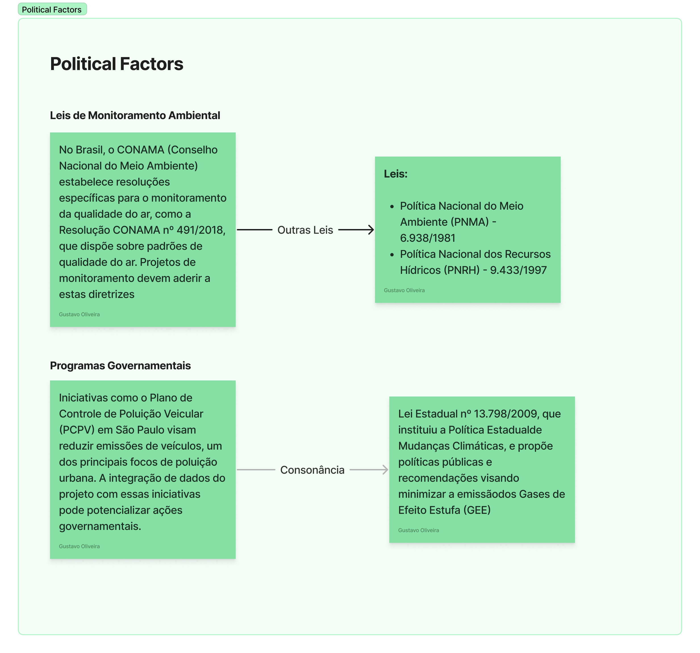
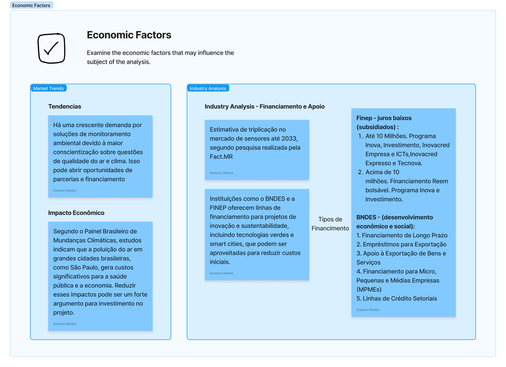
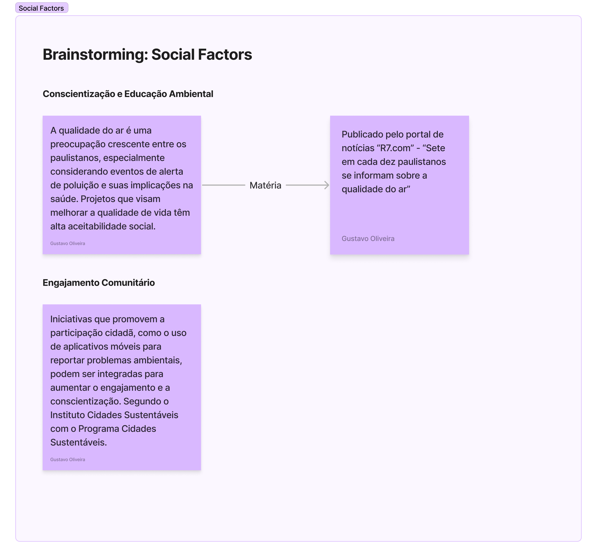
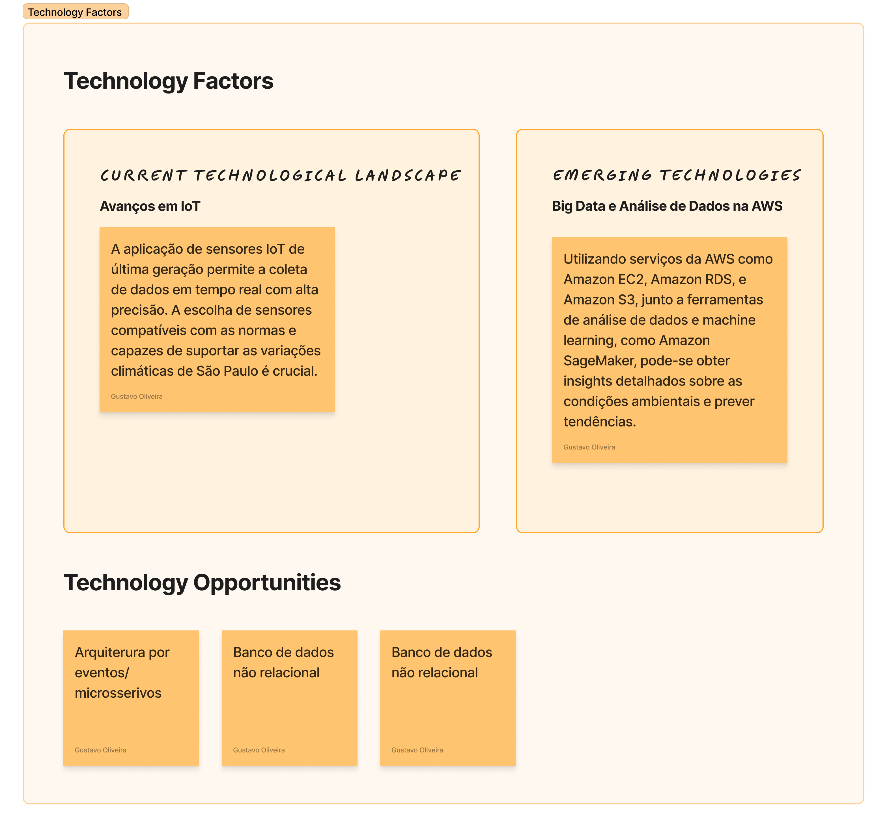
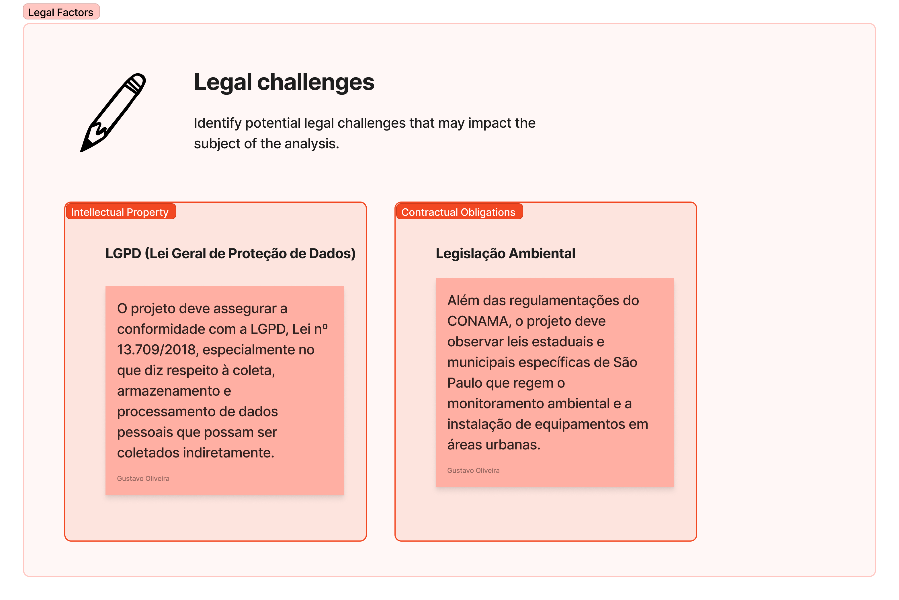
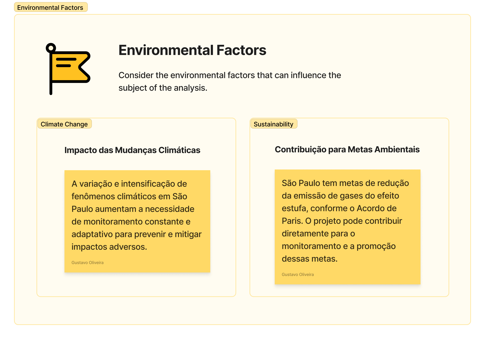

# Análise PESTEL

A análise PESTEL é uma ferramenta estratégica utilizada por organizações para compreender e avaliar o ambiente externo em que operam. Ela envolve a identificação e análise de seis categorias principais de influências macroambientais, fornecendo uma visão abrangente das oportunidades e ameaças que podem impactar a empresa. Aqui está uma descrição detalhada de cada componente:

## Fatores Politicos

Esta categoria abrange fatores relacionados ao ambiente político em que a organização opera. Isso inclui questões como estabilidade política, mudanças de governo, regulamentações governamentais, políticas fiscais e legislação trabalhista. A análise política ajuda a empresa a entender como as decisões políticas podem afetar suas operações, seus mercados-alvo e suas estratégias de negócios.

## Fatores Econômicos

Fatores econômicos referem-se às condições econômicas globais, regionais ou nacionais que afetam a organização. Isso inclui taxas de crescimento econômico, taxas de juros, inflação, desemprego, distribuição de renda e flutuações cambiais. A análise econômica permite que a empresa compreenda o poder de compra dos consumidores, os custos de produção, a demanda do mercado e a viabilidade financeira de seus projetos e investimentos.

## Fatores Sociais

Esta categoria diz respeito aos aspectos socioculturais que moldam o ambiente operacional da empresa. Isso inclui demografia, tendências de estilo de vida, valores culturais, atitudes do consumidor e padrões de comportamento. Ao analisar fatores sociais, a empresa pode identificar preferências do consumidor, necessidades não atendidas e mudanças nas demandas do mercado.

     

## Fatores Tecnológicos

Fatores tecnológicos referem-se ao estado da tecnologia e à sua influência sobre as operações da empresa. Isso inclui avanços tecnológicos, inovações disruptivas, taxas de adoção de novas tecnologias e investimentos em pesquisa e desenvolvimento. A análise tecnológica ajuda a empresa a identificar oportunidades para melhorar a eficiência operacional, desenvolver produtos inovadores e manter-se atualizada em um ambiente de negócios em constante 

## Fatores Ambientais
Esta categoria aborda fatores relacionados ao meio ambiente e à sustentabilidade. Isso inclui mudanças climáticas, regulamentações ambientais, preocupações com a pegada de carbono, gestão de resíduos e responsabilidade social corporativa. A análise ambiental ajuda a empresa a identificar riscos e oportunidades relacionados à sustentabilidade, bem como a desenvolver práticas de negócios responsáveis.

## Fatores Legais

Fatores legais referem-se às leis e regulamentações que impactam as operações da empresa. Isso inclui leis de concorrência, leis de proteção ao consumidor, regulamentações trabalhistas, leis de propriedade intelectual e regulamentações de comércio internacional. A análise legal ajuda a empresa a garantir conformidade com os requisitos legais, bem como a antecipar e responder a mudanças na legislação que possam afetar suas operações.

## Conclusão

Em conjunto, a análise PESTEL oferece uma visão holística do ambiente externo da empresa, permitindo que ela identifique tendências, antecipe mudanças e desenvolva estratégias adaptativas para se manter competitiva e bem-sucedida em seu setor.

Isso nos proporciona uma visão abrangente de como o projeto a ser desenvolvido para a "Prodan" afeta os diversos aspectos que compõem a sociedade ao nosso redor, especialmente por influenciar diretamente a cidade onde residimos.