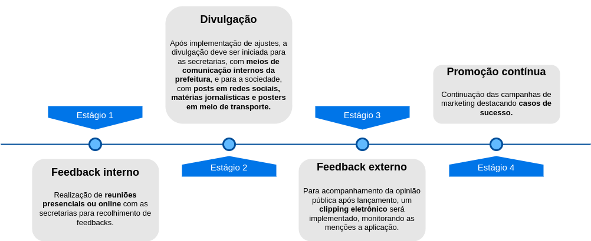

# Plano de comunicação

## Visão Geral

O plano de comunicação é uma estratégia fundamental para garantir que a mensagem certa seja entregue ao público-alvo de maneira eficaz e impactante. Ele consiste não apenas na definição clara de quem queremos atingir, mas também na escolha dos canais e meios mais adequados para alcançar essas pessoas. 

## Propósito na comunicação

É fundamental estabelecer claramente os objetivos da comunicação que devem ser alcançados, pois isso permite que escolhas mais eficazes e simplificadas sejam feitas. Nesse sentido, são destacadas três metas principais:

1. Aumentar a conscientização sobre a qualidade ambiental de São Paulo.

2. Posicionar a plataforma como uma ferramenta essencial para monitorar e melhorar o meio ambiente da cidade.

3. Promover uma adesão em massa à plataforma, buscando uma participação ativa dos cidadãos e das secretarias municipais nas decisões ambientais.

## Público-alvo

Dois públicos prioritários foram estabelecidos: a sociedade civil de São Paulo e as secretarias responsáveis pela administração da cidade.

#### Cidadãos

Para os cidadãos, a plataforma busca incentivar o engajamento da população nas ações governamentais, oferecendo um espaço onde possam contribuir com dados relevantes utilizados pelas secretarias. Ao participar ativamente desse processo, os cidadãos se tornam agentes de mudança, colaborando para o desenvolvimento sustentável da cidade e fortalecendo a democracia participativa.

#### Secretarias

Para as secretarias municipais, a plataforma visa fornecer dados detalhados que embasam decisões voltadas à melhoria da cidade. Essa disponibilidade de informações permite uma abordagem mais fundamentada e estratégica na gestão ambiental, contribuindo para soluções mais eficazes e direcionadas aos desafios enfrentados pela cidade.

### Principal Público

Para a decisão do público principal, o critério foi analisar a quantidade de impacto que cada público pode gerar. Por isso, optou-se por definir as secretarias, pois estas possuem maior poder de influência na aprovação de medidas para a cidade de São Paulo. Embora os membros da população possam submeter propostas à prefeitura, as propostas diretas dos políticos têm mais agilidade para aprovação.

### Conhecimento e Interesse

#### Cidadãos

Os níveis de interesse variam de acordo com cada grupo presente na sociedade. Por exemplo, há grupos com conhecimento mais aprofundado, como acadêmicos especializados em meio ambiente. No entanto, em geral, temos cidadãos que possuem um conhecimento prático sobre os impactos ambientais em seu cotidiano e reconhecem como esses problemas afetam diretamente sua qualidade de vida. Embora não tenham um conhecimento técnico detalhado, as consequências dos problemas ambientais são claras para eles.

#### Secretarias

As secretarias precisam possuir conhecimento técnico sobre o assunto, pois são responsáveis por definir soluções para os problemas ambientais. Elas têm acesso aos dados que serão disponibilizados na nova plataforma e, portanto, já possuem alguma familiaridade com eles. No entanto, atualmente, esses dados não estão concentrados em um único local, o que dificulta sua interpretação e análise.

### Nível de Engajamento

#### Cidadãos

O engajamento em relação ao meio ambiente varia significativamente entre os diferentes grupos da sociedade. Acadêmicos que estão diretamente envolvidos com o assunto e empresários que buscam melhorar as métricas de suas empresas em busca de vantagens são exemplos desses grupos que possuem um engajamento mais elevado. No entanto, em geral, o tema do meio ambiente ganha mais destaque entre os cidadãos quando eles enfrentam situações que afetam diretamente sua qualidade de vida e rotina, acontecendo ocasionalmente, como enchentes e quedas de árvores. Apesar disso, o interesse geral nesse tópico pode não ser tão elevado em comparação com outras questões.

#### Secretarias

As secretarias têm a responsabilidade contínua de monitorar e gerenciar questões ambientais, o que as mantém engajadas de forma consistente, ao invés de reativa, no que diz respeito ao meio ambiente. Elas operam em um contexto que requer uma análise abrangente do cenário ambiental, visando ao bem-estar dos cidadãos de São Paulo. Contudo, o interesse das secretarias pode ser influenciado pela priorização das questões ambientais em relação a outras responsabilidades municipais.

## Mensagens-Chave

A mensagem chave em um plano de comunicação é o alicerce da estratégia, pois define os pontos e informações que você deseja transmitir ao público-alvo para convencê-lo. Ela encapsula os principais benefícios, valores e diferenciais do seu produto, serviço ou ideia, de forma clara e persuasiva. É o elemento central que guia todas as outras partes do plano, desde a escolha dos canais de comunicação até a criação do conteúdo. Em suma, a mensagem chave é crucial para garantir que sua comunicação seja eficaz, coesa e capaz de atingir seus objetivos de persuasão.

Então, foram definidas duas mensagens-chave para os públicos:

#### Cidadãos

Ao abordar os residentes de São Paulo, é crucial ressaltar sua capacidade de influenciar as direções administrativas da cidade e desempenhar um papel significativo em sua melhoria, colocando o cidadão como protagonista. É importante destacar que, mesmo como indivíduos fornecendo uma única contribuição de dados, podem fazer uma diferença palpável. Além disso, é essencial informar que têm acesso fácil a informações que podem gerar grande impacto em suas vidas, influenciando nas decisões tomadas diariamente em busca de uma vida mais saudável, independente do grupo.

#### Secretarias

No que diz respeito às secretarias, é essencial apresentar uma visão sobre o potencial de aprimoramento do trabalho por meio da implementação de uma plataforma de coleta de dados. Com todos os dados necessários em um único local, a interpretação torna-se mais fácil. Além disso, o acesso a dados precisos e em tempo real fornece insights valiosos para identificar áreas prioritárias de intervenção e desenvolver políticas mais eficazes.

Com essa tecnologia, abre-se uma janela para a implementação de novas tecnologias dentro das secretarias, visualizando um futuro mais tecnológico. Assim, modelos preditivos alimentados por essa plataforma se tornam uma possibilidade e podem facilitar suas operações, o que pode motivar ainda mais os colaboradores.

## Canais de Comunicação

#### Secretarias

A comunicação com as secretarias deve ser conduzida com maior formalidade, dada a sua responsabilidade na administração de uma das maiores cidades do Brasil. Para garantir a aceitação da plataforma, é necessário um plano abrangente de persuasão.

Dentre os canais utilizados, reuniões presenciais e online seriam úteis para estabelecer um contato direto com as secretarias e validar a plataforma de acordo com o público-alvo principal, recebendo feedback de um grupo menor e mais controlado. Além disso, a divulgação por meio de canais internos seria a mais eficaz com as secretarias, uma vez que estão inseridas no mesmo contexto dos desenvolvedores da nova plataforma. Canais como a intranet e o email institucional são úteis nesse sentido.

#### Secreterias

Já com os cidadãos, a forma mais efetiva seria divulgar em canais mais acessados pela população em geral. Redes sociais, como TikTok e Instagram, programas de televisão e divulgações em meios de transporte público são parte integrante da rotina dos moradores de São Paulo.

## Cronograma

A seguir, um diagrama dos estágios que seriam percorridos pelo cronograma de comunicação:

Abordar inicialmente o público principal garante que todas as necessidades das secretarias serão atendidas antes da divulgação para todos, obtendo as informações necessárias de um ambiente menor e controlado, facilitando o aprimoramento da plataforma. Logo, iniciar por meio de reuniões com as secretarias que demonstrariam a aplicação, recolhendo feedbacks para a implementação desses ajustes antes da divulgação interna permite que essas necessidades sejam satisfeitas.

Com os ajustes feitos, a divulgação interna para as secretarias por meio da intranet e emails institucionais informará sobre o lançamento interno da plataforma e seus objetivos.

Posteriormente, será possível divulgar a aplicação para o restante da população, utilizando os meios de comunicação mais acessados pelos moradores. Além disso, o estabelecimento de um clipping eletrônico que monitora e seleciona notícias que mencionam a plataforma possibilitará acompanhar a opinião pública, destacando pontos que poderão ser utilizados num roadmap futuro.

Após o lançamento, deve-se colocar em prática a continuação das campanhas de marketing e comunicação para promover o uso contínuo da plataforma, destacando casos de sucesso e incentivando a participação dos cidadãos e das secretarias.
