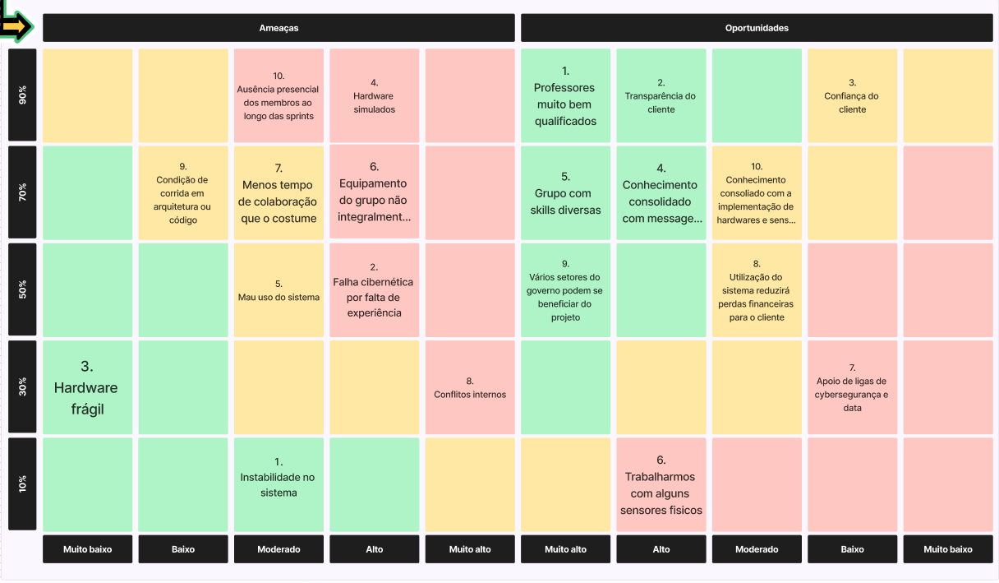

# Matriz de risco
Uma matriz de risco é uma ferramenta de gestão que permite avaliar e visualizar os diferentes riscos enfrentados por uma organização, projeto ou atividade. Geralmente representada em forma de tabela, ela classifica os riscos com base em sua probabilidade de ocorrência e impacto, ajudando a priorizar ações de mitigação e alocação de recursos. Ao identificar e classificar os riscos em categorias como baixo, médio e alto, tanto para probabilidade quanto para impacto, a matriz de risco oferece uma visão clara dos riscos mais críticos e significativos, orientando a tomada de decisões informadas para garantir o sucesso do empreendimento.

## Ameaças e plano de contingência

**1. Instabilidade no sistema:** Instabilidades no servidor podem ocorrer em diversos aspectos, a partir disso pretendemos subir vários servidores por meio de kubernets; 

**2. Falha cibernética por falta de experiência:** Devido a falta de experiência da equipe na área de cibersegurança falhas podem passar despercebidas, então após a entrega do MVP, contratar profissionais qualificados eliminaria esse problema;

**3. Hardware frágil:** O manuseio dos sensores tem que ser feito com cautela, podendo ser quebrados com facilidade, ao possuir peças reservas para a resposição dos sensores diminuímos os impactos causados por essa ameaça;

**4. Hardware simulados:** O MVP utilizará majoritariamente cenários simulados com hardwares simulados, podendo ter problemas em situações mais especificas em uma situação real, realizar testes com sensores reais individualmente em diferentes ambientes pode mitigar essa ameaça;

**5. Mau uso do sistema:** O usuário final pode ter problemas ou dificuldades de manusear o sistema final, a criação de manuais de uso ou tutoriais diminuem as chances disso ocorrer;

**6. Equipamento do grupo não integralmente qualificado:** Os sistemas dos membros do grupo podem não ser suficientes para testes mais práticos utilizando sensores diversos, evitar trabalhar localmente e utilizar da nuvem quando possível soluciona essa ameaça;

**7. Menos tempo de colaboração que o costume:** A diminuição do tempo de trabalho em conjunto pode dificultar o andamento do projeto, trabalhar melhor uma comunicação efetiva para o projeto ajuda a evitar com que problemas gerados por essa situação aconteçam;

**8. Conflitos internos:** Conflitos podem ocorrer dentro do grupo de desenvolvimento, a presença de mediadores e boa comunicação pode resolver essa ameaça;

**9. Condições de corrida em arquitetura ou código:** Funções podem criar condições de corrida quando testes não são feitos, realizar testes unitários diminui as chances desse acontecimento;

**10. Ausência presencial dos membros ao longo das sprints:** Por problemas e compromissos externos, teremos menos atividade dos membros presencialmente, que podem acabar prejudicando o andamento do projeto, a presença e comunicações de forma online mitiga esse risco.

## Oportunidades

**1. Professores muito bem qualificados;**

**2. Transparência do cliente;**

**3. Confiança do cliente;**

**4. Conhecimento consolidado com messageria e big data;**

**5. Grupo com  skills diversas;**

**6. Trabalharmos com alguns sensores fisicos;**

**7. Apoio de ligas de cybersegurança e data;**

**8. Utilização do sistema reduzirá perdas financeiras para o cliente;**

**9. Vários setores do governo podem se beneficiar do projeto;**

**10. Conhecimento consoliado com a implementação de hardwares e sensores.**

