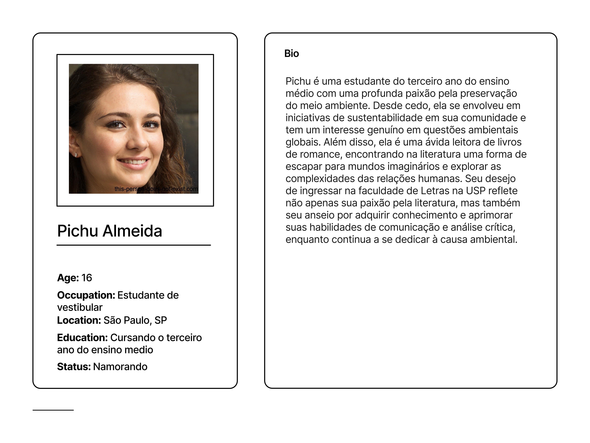
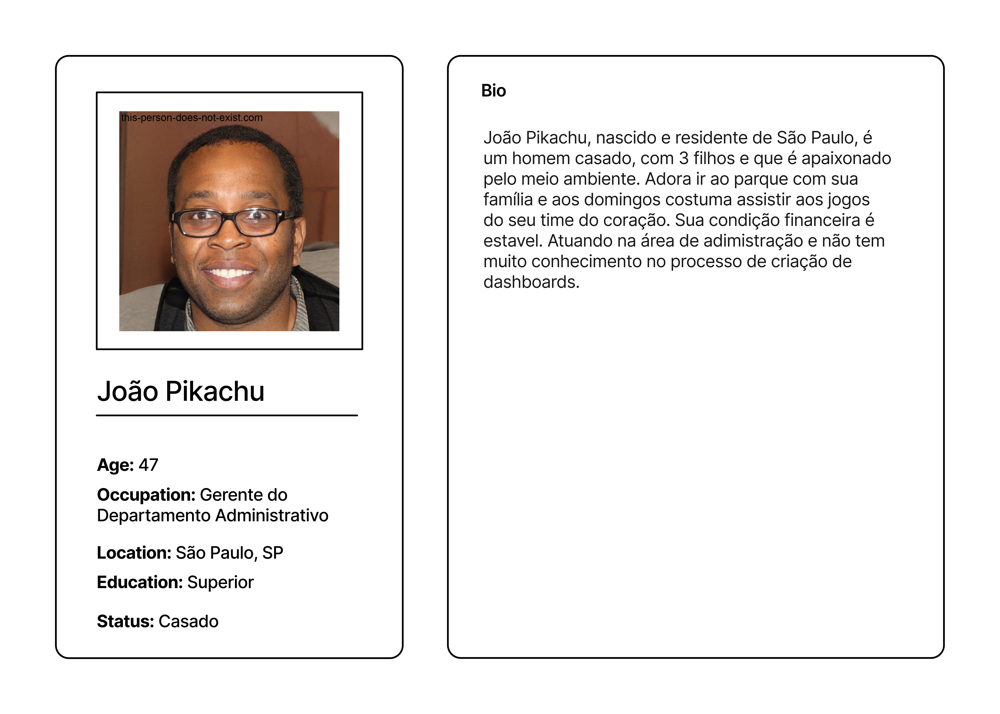
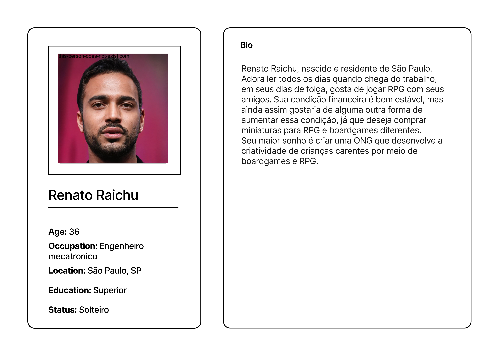

# Personas

## Introdução

Personas são ferramentas fundamentais no design de experiência do usuário, marketing e desenvolvimento de produto, representando grupos-chave de usuários com características, necessidades e comportamentos específicos. Essas representações ajudam equipes a se manterem focadas nos requisitos reais dos usuários, orientando o desenvolvimento de soluções mais eficazes e personalizadas. Ao criar personas detalhadas, os profissionais conseguem visualizar melhor quem são seus usuários finais, quais são seus desafios diários, suas motivações e como preferem interagir com produtos ou serviços. Isso facilita a criação de estratégias mais alinhadas com as expectativas e necessidades do público-alvo, permitindo uma conexão mais profunda e significativa entre usuários e soluções oferecidas.

### Personas Detalhadas

<h1>**Pichu Almeida**</h1>

Pichu Almeida é uma estudante do ensino médio de 16 anos, com uma paixão vibrante pela preservação ambiental e uma alma de leitora ávida. Ela sonha em ampliar seu impacto na causa ambiental ao ingressar na prestigiada faculdade de Letras da USP. Pichu está em busca de ferramentas e recursos que possam enriquecer suas redações com dados ambientais precisos, refletindo seu compromisso em integrar sua paixão pela literatura com sua dedicação ao meio ambiente.

<h1>**João Pikachu**</h1>

Joana Pikachu é uma gerente administrativa de 47 anos, casada, mãe de três filhos, e com uma profunda paixão pelo meio ambiente. Ela almeja crescer profissionalmente enquanto contribui ativamente para a preservação ambiental. Joana está à procura de soluções que lhe permitam acessar dashboards intuitivos para visualização de dados, além de desejar plataformas que sejam facilmente acessíveis, visando otimizar sua capacidade de tomar decisões baseadas em dados e promover ações sustentáveis em seu ambiente de trabalho e além.

<h1>**Renato Raichu**</h1>

Renata Raichu, uma engenheira mecatrônica de 36 anos, solteira e aficionada por RPG, livros e boardgames, tem o ambicioso objetivo de fundar uma ONG dedicada a fomentar a criatividade em crianças carentes. Para tornar esse sonho realidade, ela busca expandir seus conhecimentos em empreendedorismo e encontrar maneiras de gerar uma renda estável que sustente seu projeto de ONG, visando criar um impacto positivo e duradouro na vida dessas crianças.

Essas personas ilustram a diversidade dos usuários e suas distintas necessidades, servindo como base para o desenvolvimento de produtos e serviços mais alinhados com as expectativas do público-alvo.