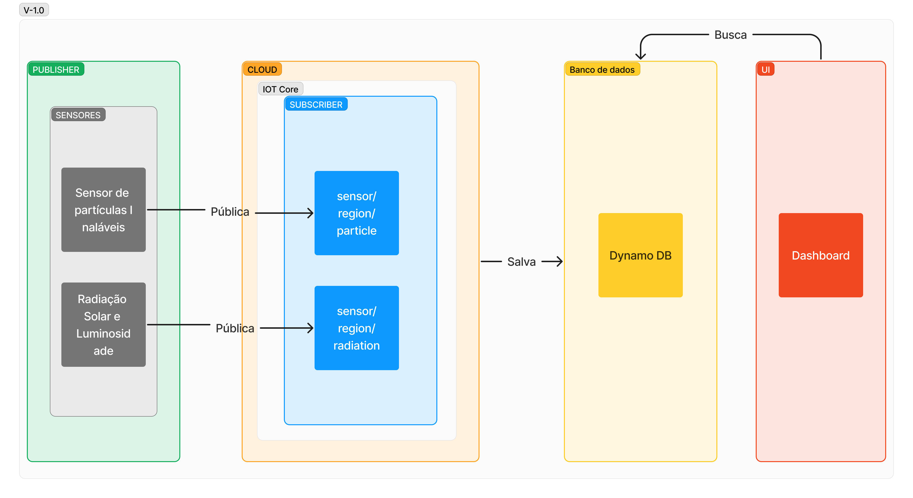

# Simulador MQTT

Durante a Sprint 1, o grupo desenvolveu a primeira versão do simulador MQTT, que é um componente essencial para o projeto. O simulador MQTT é um dispositivo que publica mensagens em tópicos MQTT, simulando o comportamento de sensores IoT. O objetivo do simulador é gerar dados de teste para o sistema.

## Diagrama de Blocos do Simulador MQTT - v1.0



O simulador atua nos primeiros dois blocos, gerando dados randomizados, representando os sensores, e publicando-os em tópicos segundo um padrão de nomenclatura. Nas próximas sprints, objetiva-se progredir na integração com o banco de dados e o dashboard.

## Funcionamento do simulador

Utilizamos abstrações em arquivos .json e CSV para garantir a reutilização do código. O arquivo .json contém configurações como taxa de transmissão, tipo de sensor, região e unidade, enquanto o CSV armazena valores simulados do sensor. Esses arquivos são especificados como argumentos de linha de comando do publisher.

Para gerar os valores do CSV, empregamos o script "generator.py", que recebe parâmetros como o número de dados a serem criados, valor mínimo, valor máximo e resolução também pela linha de comando.

Os dados são publicados como json com metadados no tópico `sensor/<região>/<nome-do-sensor>`.

Todas as principais funções, incluindo conexão com o broker, integridade de mensagens, taxa de transmissão e QoS, são testadas automaticamente em Python, através do GitHub Actions.

## Como rodar

### 1. Gerar dados de simulação

Primeiro, é necessário gerar os dados para simulação. Para isso, execute os seguintes comandos no diretório `~/src/simulador/mqtt_python`:

```
pip install csv paho-mqtt
```

```
python3 generator.py <num_de_valores> <resolucao> <valor_minimo> <valor_maximo> <nome_do_arquivo>
```

Isso gerará um CSV com o título escolhido.

A partir daí, podemos simular a leitura desse CSV (ou de qualquer outro).

### 2. Criar arquivo de configuração

Crie um arquivo de configuração JSON com informações sobre o sensor. O arquivo deve seguir o seguinte padrão:

```
{
    "sensor": <nome_do_sensor>,
    "region": <regiao>,
    "transmission_rate_hz": <taxa_de_transmissao_em_herz>,
    "unit": <unidade>,
    "QoS": <qos>
}
```

### 3. Executar o Publisher MQTT

Certifique-se de ter o mosquitto instalado com arquivo de configuração (ouvindo na porta 1891) e inicie o broker local:

```
mosquitto -c mosquitto.conf
```

Execute o script publisher.py passando o caminho do arquivo de configuração JSON e o caminho do arquivo CSV:

```
python3 run publisher.py <config_path> <csv_path>
```

## Estrutura dos dados

### Configuração (arquivo json)

- unit: Unidade do sensor.
- transmission_rate_hz: Taxa de transmissão em Hertz.
- region: Região do sensor.
- sensor: Nome do sensor.
- qos: Qualidade de serviço para comunicação MQTT.

### Dados do Sensor (json publicado no tópico)

- value: Valor lido pelo sensor (proveniente do CSV)
- unit: Unidade do sensor.
- transmission_rate_hz: Taxa de transmissão em Hertz.
- region: Região do sensor.
- sensor: Nome do sensor.
- timestamp: Timestamp da leitura do sensor.
- qos: Qualidade de serviço para comunicação MQTT.

## Testes e validações do simulador MQTT

O projeto inclui testes automatizados para garantir a robustez e a integridade do código. Eles abrangem as seguintes áreas-chave:

### 1. Conexão com broker

Este teste verifica se é possível conectar-se com sucesso ao broker MQTT. Ele utiliza a função connect_mqtt para estabelecer uma conexão e, em seguida, verifica se a conexão foi bem-sucedida aferindo se o objeto client é diferente de nulo. Se a conexão for estabelecida com sucesso, o teste é considerado passado; caso contrário, é considerado falho.

```python
def test_connect_mqtt():
    client = connect_mqtt("publisher")
    assert client
    client.disconnect()
```

### 2. Chegada de mensagens

Este teste verifica se as mensagens são recebidas corretamente. Ele configura um ambiente de teste usando a função setupTest, que cria uma subscrição MQTT para o tópico específico e publica dados simulados. Em seguida, o teste aguarda um período de tempo que permitiria a recepção de todas as mensagens esperadas. Se nenhuma mensagem for recebida, o teste falha; caso contrário, é considerado passado. Utilizamos essa condição porque, dependendo do QoS escolhido, pode haver o recebimento de mais mensagens do que enviadas; portanto, o a comparação entre quantas mensagens foram enviadas e recebidas não é um bom critério. Em vez disso, checamos a integridade das mensagens no teste seguinte.

```python
def test_message_reception():
    client = setup_test()

    num_messages = len(mock_data)
    time_per_message = 1/mock_config.transmission_rate_hz
    time_margin = 0.5 * time_per_message
    total_time = num_messages * time_per_message + time_margin
    time.sleep(total_time)

    assert len(received_messages) > 0
    client.disconnect()

```

### 3. Integridade das Mensagens

O teste `test_message_integrity` garante a integridade das mensagens recebidas. Ele decodifica cada mensagem recebida e verifica se cada valor em `mock_data` tem pelo menos uma correspondência em `decoded_messages`. Isso garante que os valores esperados estejam presentes nas mensagens recebidas, embora não necessariamente na mesma ordem.

```python

def test_message_integrity():
    setup_test()  
    decoded_messages = []
    for msg in received_messages:
        m = json.loads(msg)
        decoded_messages.append(m)

    for expected_value in mock_data:
        assert any(msg['value'] == expected_value for msg in decoded_messages)
```

Este teste assegura que cada valor em mock_data seja incluído nas mensagens recebidas, garantindo assim a integridade e a correspondência dos dados.

### 4. Taxa de transmissão

Este teste verifica se a taxa de transmissão das mensagens está dentro de uma faixa aceitável (default de +/- 10Hz) em relação à taxa configurada. Ele calcula o período de tempo entre a primeira e a última mensagem recebida e, com base nisso, calcula a frequência real das mensagens. Se a frequência estiver fora da faixa aceitável, o teste falha; caso contrário, é considerado passado.

```python
def test_transmission_rate():
    setup_test()  
    print(first_message_timestamp, last_message_timestamp)
    time_period = timedelta(
        seconds=(last_message_timestamp - first_message_timestamp)
        ).total_seconds()
    frequency = len(mock_data) / time_period

    # Check transmission rate
    assert abs(frequency - mock_config.transmission_rate_hz) < 10


```

### 5. QoS

Este teste avalia a correta entrega de mensagens conforme configurado pelo QoS. Ele publica uma única mensagem simulada com a configuração de QoS especificada, verifica se ela foi entregue corretamente segundo seu QoS e, em seguida, relata o resultado do teste.

```python

def test_qos():
    global received_messages
    received_messages = []
    client = connect_mqtt("subscriber")

    client.loop_start()

    def on_message(client, userdata, message):
        received_messages.append(message.payload.decode())

    client.on_message = on_message

    client.subscribe(f'sensor/{mock_config.region}/{mock_config.sensor}',
                     mock_config.qos)

    mock_qos_data = [1.25]
    publish_data(client, mock_config, mock_qos_data)

    if mock_config.qos == 0:
        print(
            "\x1b[33m[INFO] QoS set to 0, no guarantee of message delivery"
            "\x1b[0m"
        )
    elif mock_config.qos == 1:
        if len(received_messages) == 0:
            raise AssertionError(
                "\x1b[31m[FAIL] No messages received with QoS 1\x1b[0m"
                )
        else:
            for msg in received_messages:
                m = json.loads(msg)
                if m['value'] != mock_qos_data[0]:
                    raise AssertionError(
                        "\x1b[31m[FAIL] Received {}, expected {}\x1b[0m"
                        .format(m['value'], mock_qos_data[0])
                        )
            print("\x1b[32m[PASS] Message received with QoS 1\x1b[0m")
    elif mock_config.qos == 2:
        if len(received_messages) != 1:
            raise AssertionError(
                "\x1b[31m[FAIL] Incorrect number of messages received"
                "with QoS 2. Expected: 1, received: {}\x1b[0m"
                .format(len(received_messages)))
        else:
            m = json.loads(received_messages[0])
            if m['value'] != mock_qos_data[0]:
                raise AssertionError(
                    "\x1b[31m[FAIL] Received {}, expected {}\x1b[0m"
                    .format(m['value'], mock_qos_data[0])
                )
            print("\x1b[32m[PASS] Message received with QoS 2\x1b[0m")
    else:
        raise AssertionError(
            "\x1b[31m[FAIL] Invalid QoS value: {}\x1b[0m".format(
                mock_config.qos
                )
            )


```
