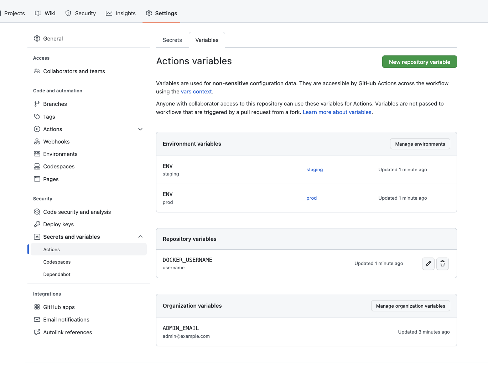

# GitHub Actions

O GitHub Actions é uma ferramenta de automação de fluxo de trabalho que permite a criação de fluxos de trabalho personalizados em um repositório do GitHub. Com ele, é possível criar, testar e implantar o código do projeto. 

## Vantagens

A utilização do GitHub Actions traz diversas vantagens para o projeto, como:

- **Integração com o GitHub**: O GitHub Actions é integrado ao GitHub, o que facilita a criação de fluxos de trabalho para o projeto.
- **Automação de Tarefas**: Com o GitHub Actions, é possível automatizar tarefas como testes, build e deploy do projeto.
- **Personalização**: O GitHub Actions permite a criação de fluxos de trabalho personalizados, que atendem as necessidades do projeto.
- **Integração com Outras Ferramentas**: O GitHub Actions é integrado com diversas ferramentas, o que permite a criação de fluxos de trabalho mais complexos.
- **Facilidade de Uso**: O GitHub Actions é uma ferramenta de fácil utilização, o que facilita a criação de fluxos de trabalho.
- **Comunidade Ativa**: O GitHub Actions possui uma comunidade ativa, o que facilita a busca por soluções para problemas.
- **Segurança**: O GitHub Actions é uma ferramenta segura, o que garante a segurança dos fluxos de trabalho criados.

## Configuração

Dentro do processo de automação de tarefas, o GitHub Actions é uma ferramenta que permite a criação de fluxos de trabalho personalizados. Para criar um fluxo de trabalho no GitHub Actions, é necessário criar um arquivo de configuração chamado `workflow.yml` na pasta `.github/workflows` do repositório do projeto.

Além da criação de arquivos de configuração, é possível utilizar o GitHub Actions para genrenciar chaves de API, variáveis de ambiente e segredos do projeto. Essa configuração é feita através do painel de configurações do repositório no GitHub, acessando a aba `Settings` e em seguida a aba `Secrets` e `Actions`. Trazeno mais segurança e confiabilidade para o projeto.



### Variáveis de Ambiente do Projeto

A construção de um projeto de software é um processo complexo que envolve a execução de diversas tarefas, como testes, build e deploy. Para facilitar a execução dessas tarefas, é possível utilizar variáveis de ambiente no GitHub Actions. As variáveis de ambiente são valores que podem ser acessados por um fluxo de trabalho e que podem ser utilizados para armazenar informações sensíveis, como chaves de API e tokens de acesso. Atualmente, o projeto utiliza as seguintes variáveis de ambiente:

```env
    AWS_ACCESS_KEY_ID = ${{ secrets.AWS_ACCESS_KEY_ID }}
    AWS_SECRET_ACCESS_KEY = ${{ secrets.AWS_SECRET_ACCESS_KEY }}
    AWS_REGION = ${{ secrets.AWS_REGION }}
    AWS_BUCKET_NAME = ${{ secrets.AWS_BUCKET_NAME }}
```
#### Descrição das Variáveis de Ambiente

- **AWS_ACCESS_KEY_ID**: Chave de acesso da AWS.
- **AWS_SECRET_ACCESS_KEY**: Chave secreta de acesso da AWS.
- **AWS_REGION**: Região da AWS.
- **AWS_BUCKET_NAME**: Nome do bucket da AWS que irá armazenar os arquivos de estado do Terraform.

## Fluxo de Trabalho Existentes

Atualmente, o projeto possui os seguintes fluxos de trabalho no GitHub Actions:

- **Deploy Docussaurus**: Fluxo de trabalho que realiza o deploy da documentação do projeto.
- **Terraform - Up S3 Infrascruture**: Fluxo de trabalho que realiza o deploy da infraestrutura do projeto.
- **Terraform - Up Infrastruture**: Fluxo de trabalho que realiza o deploy da infraestrutura do projeto.
- **Terraform - Down Infrastruture**: Fluxo de trabalho que realiza o down da infraestrutura do projeto.
- **MQTT - publish simulated data**: Fluxo de trabalho que publica dados mockados para todos os sensores e regiões.
- **[TESTS] MQTT**: Fluxo de trabalho que roda suite de testes do MQTT.

### Deploy Docussaurus

O fluxo de trabalho `deploy-docussaurus` realiza o deploy da documentação do projeto. Esse fluxo de trabalho é acionado quando um push é realizado na branch `main` do repositório e realiza o deploy automático de um site Docusaurus no GitHub Pages. O fluxo de trabalho realiza os seguintes passos:

O job principal (`build-docusaurus`) realiza as seguintes tarefas:

1. **Checkout do Código**: Faz o checkout do código-fonte do repositório usando a ação `actions/checkout@v4`.
2. **Configuração do Node.js**: Prepara o ambiente de execução com a versão 18 do Node.js através da ação `actions/setup-node@v3`.
3. **Instalação e Build**:
    - Navega até o diretório `docs`, onde o código do Docusaurus está localizado.
    - Executa `npm install` para instalar as dependências do projeto.
    - Executa `npm run build` para construir o site estático do Docusaurus.
    - Move o diretório de build para o diretório raiz, facilitando o passo de deploy.
4. **Configuração da Página**: Utiliza `actions/configure-pages@v3` para preparar o ambiente para o deploy na GitHub Pages.
5. **Upload do Artefato**: Carrega o site construído como um artefato para o GitHub através da ação `actions/upload-pages-artifact@v2`, especificando o caminho para o diretório de build.
6. **Deploy na GitHub Pages**: Finalmente, realiza o deploy do artefato para a GitHub Pages usando `actions/deploy-pages@v2`, atribuindo este passo a um ID (`deployment`) para permitir referências futuras, como obter a URL da página após o deploy.

#### Resultado
Após a execução bem-sucedida dos passos acima, o site Docusaurus é automaticamente construído e publicado na GitHub Pages, tornando o conteúdo atualizado disponível na web. A configuração garante que as atualizações sejam processadas eficientemente e sem intervenção manual, exceto pela execução manual via workflow dispatch se necessário.

#### Código do Fluxo de Trabalho
```yaml
name: Deploy Docusaurus

on:
  push:
    branches: ["main"]
    paths:
      - 'docs/**'
# Allows you to run this workflow manually from the Actions tab
  workflow_dispatch:

# Sets permissions of the GITHUB_TOKEN to allow deployment to GitHub Pages
permissions:
  contents: read
  pages: write
  id-token: write

# Allow one concurrent deployment
concurrency:
  group: "pages"
  cancel-in-progress: true

env:
  # Hosted GitHub runners have 7 GB of memory available, let's use 6 GB
  NODE_OPTIONS: --max-old-space-size=6144

jobs:
  build-docusaurus:
    environment:
      name: github-pages
      url: ${{ steps.deployment.outputs.page_url }}
    runs-on: ubuntu-latest

    steps:
    - name: Checkout code
      uses: actions/checkout@v4

    - name: Setup Node.js
      uses: actions/setup-node@v3
      with:
        node-version: 18

    - name: Install and Build
      run: |
        cd docs
        npm install
        npm run build
        mv build ../build
        
    - name: Setup Pages
      uses: actions/configure-pages@v3
        
    - name: Upload artifact
      uses: actions/upload-pages-artifact@v2
      with:
        path: ./build

    - name: Deploy to GitHub Pages
      id: deployment
      uses: actions/deploy-pages@v2

```

### Terraform - Up S3 Infrascruture

O fluxo de trabalho `terraform-up-s3-infrascruture` realiza o deploy da infraestrutura do projeto. Esse fluxo de trabalho é acionado de forma manual, a partir da branch `main` do repositório e realiza o deploy automático da infraestrutura do projeto na AWS. O fluxo de trabalho realiza os seguintes passos:

O job principal (`terraform`) executa as seguintes tarefas em um ambiente Ubuntu mais recente, sob o contexto de um ambiente de produção:

1. **Checkout**: Faz o checkout do código-fonte do repositório usando `actions/checkout@v2`.
2. **Setup AWS Credentials**: Configura as credenciais da AWS no ambiente de execução utilizando `aws-actions/configure-aws-credentials@v1`, permitindo que o Terraform e outros comandos da AWS CLI interajam com a conta da AWS.
3. **Setup Terraform**: Prepara o ambiente de execução com a instalação do Terraform através de `hashicorp/setup-terraform@v1`.
4. **Terraform Init**: Executa `terraform init` no diretório especificado (`infrastructure/terraform/s3-state`), inicializando o Terraform com as configurações necessárias para o projeto.
5. **Terraform Plan e Apply**: Realiza `terraform plan` para criar um plano de execução e `terraform apply` para aplicar as mudanças na infraestrutura. Essa etapa é feita automaticamente e sem interação manual (`-auto-approve`), seguindo as melhores práticas para automação de CI/CD.
6. **Get Last Bucket Name**: Utiliza a AWS CLI para consultar e armazenar o nome do último bucket criado. Isso é útil para dinamizar o processo de armazenamento dos estados do Terraform, garantindo que eles sejam enviados ao bucket correto.
7. **Upload Terraform State files to S3**: Finalmente, carrega os arquivos de estado do Terraform (`terraform.tfstate` e `terraform.tfstate.backup`) para o bucket S3 identificado anteriormente. Isso é feito utilizando comandos `aws s3 cp`, garantindo que o estado do Terraform seja preservado e acessível para futuras operações.

#### Resultado
Após a execução bem-sucedida dessas etapas, a infraestrutura definida pelos arquivos de Terraform no diretório especificado é aplicada na AWS, e os arquivos de estado do Terraform são armazenados de forma segura em um bucket S3. Isso facilita a gestão do estado do Terraform em ambientes de produção, permitindo uma fácil colaboração entre membros da equipe e automatizando o processo de infraestrutura como código (IaC) através do GitHub Actions.

#### Código do Fluxo de Trabalho
```yaml
name: "Terraform - Up S3 State"

on:
  workflow_dispatch:

permissions:
  contents: read

env:
  AWS_ACCESS_KEY_ID: ${{ secrets.AWS_ACCESS_KEY_ID }}
  AWS_SECRET_ACCESS_KEY: ${{ secrets.AWS_SECRET_ACCESS_KEY }}
  AWS_SESSION_TOKEN: ${{ secrets.AWS_SESSION_TOKEN }}
  AWS_REGION: ${{ secrets.AWS_REGION }}
  BUCKET_TERRAFORM_STATE: ${{ secrets.BUCKET_TERRAFORM_STATE }}
  LAST_BUCKET_NAME: ''

jobs:
  terraform:
    name: "Terraform"
    runs-on: ubuntu-latest
    environment: production

    defaults:
      run:
        shell: bash

    steps:
        
      - name: Checkout
        uses: actions/checkout@v2

      - name: Setup AWS Credentials
        uses: aws-actions/configure-aws-credentials@v1
        with:
          aws-access-key-id: ${{ env.AWS_ACCESS_KEY_ID }}
          aws-secret-access-key: ${{ env.AWS_SECRET_ACCESS_KEY }}
          aws-session-token: ${{ env.AWS_SESSION_TOKEN }}
          aws-region: ${{ env.AWS_REGION }}

      - name: Setup Terraform
        uses: hashicorp/setup-terraform@v1

      - name: Terraform Init
        working-directory: infrastructure/terraform/s3-state
        run: terraform init

      - name: Terraform Plan e Terraform Apply        
        working-directory: infrastructure/terraform/s3-state
        run: terraform plan -input=false -out=tfplan && terraform apply -auto-approve -input=false tfplan
        continue-on-error: true

      - name: Get Last Bucket Name
        run: |
            LAST_BUCKET_NAME=$(aws s3api list-buckets --query 'Buckets[?CreationDate==`max(CreationDate)`].[Name]' --output text)
            echo "Last bucket name: $LAST_BUCKET_NAME"
            echo "LAST_BUCKET_NAME=$LAST_BUCKET_NAME" >> $GITHUB_ENV
      - name: Upload Terraform State files to S3
        working-directory: infrastructure/terraform/s3-state
        run: |
          LAST_BUCKET_NAME=$(aws s3api list-buckets --query 'Buckets[?CreationDate==`max(CreationDate)`].[Name]' --output text)
          echo "Last bucket name: $LAST_BUCKET_NAME"
          aws s3 cp terraform.tfstate s3://${{env.LAST_BUCKET_NAME}}/state-files/terraform.tfstate
          aws s3 cp terraform.tfstate.backup s3://${{env.LAST_BUCKET_NAME}}/state-files/terraform.tfstate.backup
fix: path keys

```

### Terraform - Up Infrastruture

O fluxo de trabalho `terraform` realiza o deploy da infraestrutura do projeto. Esse fluxo de trabalho é acionado de forma manual, a partir da branch `main` do repositório e realiza o deploy automático da infraestrutura do projeto na AWS. O fluxo de trabalho realiza os seguintes passos:

1. **Checkout**: Faz checkout do código do repositório para o runner do GitHub Actions usando `actions/checkout@v2`.
2. **Configuração das Credenciais AWS**: Utiliza `aws-actions/configure-aws-credentials@v1` para configurar as credenciais da AWS no ambiente, permitindo a interação com os serviços da AWS durante o workflow.
3. **Download dos Arquivos de Estado do Terraform**: Baixa os arquivos de estado do Terraform armazenados no S3 para sincronizar o estado local com o estado remoto, garantindo a consistência do gerenciamento de infraestrutura.
4. **Setup do Terraform**: Prepara o ambiente com a ação `hashicorp/setup-terraform@v1`, facilitando o uso dos comandos do Terraform.
5. **Inicialização do Terraform**: Executa `terraform init` no diretório especificado para inicializar o Terraform, preparando o projeto para futuras ações.
6. **Formatação do Terraform**: Verifica a formatação dos arquivos do Terraform usando `terraform fmt -check`, garantindo a aderência às boas práticas de codificação.
7. **Validação do Terraform**: Executa `terraform validate` para validar a sintaxe dos arquivos de configuração do Terraform, assegurando que estão corretos antes de aplicar as mudanças.
8. **Checagem de Mudanças no Diretório 'infrastructure'**: Usa um script para verificar se houve alterações significativas nos arquivos de infraestrutura que justifiquem a execução do Terraform Plan e Apply. Se não houver mudanças, o workflow é encerrado sem erro.
9. **Execução do Terraform Plan e Apply**: Gera um plano de execução com `terraform plan` e, em seguida, aplica as mudanças com `terraform apply -auto-approve`, atualizando a infraestrutura na AWS conforme definido nos arquivos de configuração.
10. **Upload dos Arquivos de Estado do Terraform para o S3**: Após a aplicação bem-sucedida das mudanças, os arquivos de estado do Terraform são atualizados no S3, garantindo que o estado remoto reflita a infraestrutura atual.

#### Resultado
Essa pipeline facilita o gerenciamento da infraestrutura como código, automatizando o provisionamento e a atualização dos recursos da AWS através do Terraform. Permite uma execução controlada e manual, ideal para cenários onde as mudanças precisam ser aplicadas com supervisão ou em momentos específicos.

#### Código do Fluxo de Trabalho
```yaml
name: "Terraform - Up Infrastructure"

on:
  workflow_dispatch:

permissions:
  contents: read

env:
  AWS_ACCESS_KEY_ID: ${{ secrets.AWS_ACCESS_KEY_ID }}
  AWS_SECRET_ACCESS_KEY: ${{ secrets.AWS_SECRET_ACCESS_KEY }}
  AWS_SESSION_TOKEN: ${{ secrets.AWS_SESSION_TOKEN }}
  AWS_REGION: ${{ secrets.AWS_REGION }}
  BUCKET_TERRAFORM_STATE: ${{ secrets.BUCKET_TERRAFORM_STATE }}

jobs:
  terraform:
    name: "Terraform"
    runs-on: ubuntu-latest
    environment: production

    defaults:
      run:
        shell: bash

    steps:
        
      - name: Checkout
        uses: actions/checkout@v2

      - name: Setup AWS Credentials
        uses: aws-actions/configure-aws-credentials@v1
        with:
          aws-access-key-id: ${{ env.AWS_ACCESS_KEY_ID }}
          aws-secret-access-key: ${{ env.AWS_SECRET_ACCESS_KEY }}
          aws-session-token: ${{ env.AWS_SESSION_TOKEN }}
          aws-region: ${{ env.AWS_REGION }}

      - name: Download Terraform State files from S3
        working-directory: infrastructure/terraform/global
        run: |
          aws s3 cp s3://${{env.BUCKET_TERRAFORM_STATE}}/state-files/terraform.tfstate terraform.tfstate
          aws s3 cp s3://${{env.BUCKET_TERRAFORM_STATE}}/state-files/terraform.tfstate.backup terraform.tfstate.backup
        continue-on-error: true

      - name: Setup Terraform
        uses: hashicorp/setup-terraform@v1

      - name: Terraform Init
        working-directory: infrastructure/terraform/global
        run: terraform init

      - name: Terraform Format
        working-directory: infrastructure/terraform/global
        run: terraform fmt -check

      - name: Terraform Validate
        working-directory: infrastructure/terraform/global
        run: terraform validate

      - name: Check for Changes in 'infrastructure' folder
        run: |
          if git diff --name-only ${{ github.event.before }} ${{ github.sha }} | grep -q '^infrastructure/terraform/global/'; then
            echo "Alterações encontradas na pasta 'infrastructure'. Executando Terraform Plan."
          else
            echo "Nenhuma alteração na pasta 'infrastructure'. Ignorando o Terraform Plan."
            exit 0  # Encerra o fluxo de trabalho sem erro
          fi

      - name: Terraform Plan e Terraform Apply        
        working-directory: infrastructure/terraform/global
        run: terraform plan -input=false -out=tfplan && terraform apply -auto-approve -input=false tfplan
        continue-on-error: true

      - name: Upload Terraform State files to S3
        working-directory: infrastructure/terraform/global
        run: |
          aws s3 cp terraform.tfstate s3://${{env.BUCKET_TERRAFORM_STATE}}/state-files/terraform.tfstate
          aws s3 cp terraform.tfstate.backup s3://${{env.BUCKET_TERRAFORM_STATE}}/state-files/terraform.tfstate.backup
```

### Terraform - Down Infrastruture

O fluxo de trabalho `terraform` realiza o down da infraestrutura do projeto. Esse fluxo de trabalho é acionado de forma manual, a partir da branch `main` do repositório e realiza o down automático da infraestrutura do projeto na AWS. O fluxo de trabalho realiza os seguintes passos:

1. **Checkout**: Realiza o checkout do código fonte usando `actions/checkout@v2`.
2. **Configuração das Credenciais AWS**: Utiliza `aws-actions/configure-aws-credentials@v1` para configurar as credenciais AWS no ambiente, habilitando a comunicação com os serviços AWS.
3. **Download dos Arquivos de Estado do Terraform**: Baixa os arquivos de estado do Terraform do bucket S3 especificado para o ambiente de execução, permitindo que o Terraform entenda a configuração atual da infraestrutura.
4. **Setup do Terraform**: Prepara o ambiente para o uso do Terraform com `hashicorp/setup-terraform@v1`, facilitando a execução de comandos do Terraform.
5. **Inicialização do Terraform**: Executa `terraform init` no diretório especificado para inicializar o Terraform, preparando o projeto para o comando de destruição.
6. **Destruição da Infraestrutura (Terraform Destroy)**: Executa `terraform destroy -auto-approve` para remover toda a infraestrutura definida nos arquivos de configuração do Terraform. A flag `-auto-approve` garante que a destruição ocorra sem interação manual, importante para execuções automáticas.
7. **Upload dos Arquivos de Estado Atualizados para o S3**: Após a remoção da infraestrutura, os arquivos de estado atualizados são enviados de volta ao S3. Isso garante que o estado remoto reflita corretamente a ausência da infraestrutura desprovisionada.

#### Resultado
Essa pipeline facilita a remoção segura e controlada da infraestrutura AWS gerenciada pelo Terraform, essencial para evitar custos desnecessários e manter a gestão eficaz do ambiente. O processo manual através do workflow dispatch permite que equipes executem a limpeza de recursos com consciência e precisão, adequando-se a políticas de governança e compliance.

#### Código do Fluxo de Trabalho
```yaml
name: "Terraform - Down Infrastructure"

on:
  workflow_dispatch:

permissions:
  contents: read

env:
  AWS_ACCESS_KEY_ID: ${{ secrets.AWS_ACCESS_KEY_ID }}
  AWS_SECRET_ACCESS_KEY: ${{ secrets.AWS_SECRET_ACCESS_KEY }}
  AWS_SESSION_TOKEN: ${{ secrets.AWS_SESSION_TOKEN }}
  AWS_REGION: ${{ secrets.AWS_REGION }}
  BUCKET_TERRAFORM_STATE: ${{ secrets.BUCKET_TERRAFORM_STATE }}

jobs:
  terraform:
    name: "Terraform"
    runs-on: ubuntu-latest
    environment: production

    defaults:
      run:
        shell: bash

    steps:
        
      - name: Checkout
        uses: actions/checkout@v2

      - name: Setup AWS Credentials
        uses: aws-actions/configure-aws-credentials@v1
        with:
          aws-access-key-id: ${{ env.AWS_ACCESS_KEY_ID }}
          aws-secret-access-key: ${{ env.AWS_SECRET_ACCESS_KEY }}
          aws-session-token: ${{ env.AWS_SESSION_TOKEN }}
          aws-region: ${{ env.AWS_REGION }}

      - name: Download Terraform State files from S3
        working-directory: infrastructure/terraform/global
        run: |
          aws s3 cp s3://${{env.BUCKET_TERRAFORM_STATE}}/state-files/terraform.tfstate terraform.tfstate
          aws s3 cp s3://${{env.BUCKET_TERRAFORM_STATE}}/state-files/terraform.tfstate.backup terraform.tfstate.backup
        continue-on-error: true

      - name: Setup Terraform
        uses: hashicorp/setup-terraform@v1

      - name: Terraform Init
        working-directory: infrastructure/terraform/global
        run: terraform init

      - name: Terraform Destroy     
        working-directory: infrastructure/terraform/global
        run: terraform destroy -auto-approve
        continue-on-error: true

      - name: Upload Terraform State files to S3
        working-directory: infrastructure/terraform/global
        run: |
          aws s3 cp terraform.tfstate s3://${{env.BUCKET_TERRAFORM_STATE}}/state-files/terraform.tfstate
          aws s3 cp terraform.tfstate.backup s3://${{env.BUCKET_TERRAFORM_STATE}}/state-files/terraform.tfstate.backup
```

### MQTT - publish simulated data

Este fluxo de trabalho automatizado é responsável por publicar dados simulados de sensores MQTT em diferentes regiões. Ele configura o ambiente, baixa chaves de autenticação e certificados necessários, instala dependências Python e inicia a publicação dos dados simulados usando um script Python.

Ele foi projetado para simular o funcionamento de sensores MQTT em diversas regiões. Ele utiliza o protocolo MQTT para enviar dados simulados de sensores, como CO, CO2, NO2, PM10, PM2.5, entre outros, para uma infraestrutura de nuvem AWS.
Para isso, são executados estes passos:

1. **Checkout:** Clona o repositório de código para o ambiente de execução do GitHub Actions.
2. **Configuração de Credenciais da AWS:** Configura as credenciais da AWS para acesso aos recursos na nuvem.
3. **Download de Chaves de Autenticação e Certificados:** Baixa as chaves de autenticação e certificados necessários do bucket S3.
4. **Download do CA (Certificado de Autoridade):** Baixa o certificado raiz da Amazon Trust necessário para autenticação SSL/TLS.
6. **Instalação de Dependências Python:** Instala a biblioteca awsiotsdk para permitir a comunicação com o serviço AWS IoT.
7. **Execução do Script:** Inicia a execução do script Python publisher.py, que simula a publicação de dados de sensores em várias regiões. Os dados são publicados para os tópicos MQTT correspondentes.

#### Resultado
Ao final da execução deste fluxo de trabalho, dados simulados de sensores MQTT serão publicados na infraestrutura de nuvem AWS em diversas regiões. Isso permite testar a integração e o funcionamento do sistema de comunicação MQTT em um ambiente controlado. Os resultados da publicação dos dados podem ser monitorados nos logs de saída do GitHub Actions.

#### Código do Fluxo de Trabalho

```yaml
name: "MQTT - publish simulated data"

on:
  workflow_dispatch:

permissions:
  contents: read

env:
  AWS_ACCESS_KEY_ID: ${{ secrets.AWS_ACCESS_KEY_ID }}
  AWS_SECRET_ACCESS_KEY: ${{ secrets.AWS_SECRET_ACCESS_KEY }}
  AWS_SESSION_TOKEN: ${{ secrets.AWS_SESSION_TOKEN }}
  AWS_REGION: ${{ secrets.AWS_REGION }}
  BUCKET_TERRAFORM_STATE: ${{ secrets.BUCKET_TERRAFORM_STATE }}

jobs:
  terraform:
    name: "Download - Sensors Keys"
    runs-on: ubuntu-latest
    environment: production

    defaults:
      run:
        shell: bash

    steps:
        
      - name: Checkout
        uses: actions/checkout@v2

      - name: Setup AWS Credentials
        uses: aws-actions/configure-aws-credentials@v1
        with:
          aws-access-key-id: ${{ env.AWS_ACCESS_KEY_ID }}
          aws-secret-access-key: ${{ env.AWS_SECRET_ACCESS_KEY }}
          aws-session-token: ${{ env.AWS_SESSION_TOKEN }}
          aws-region: ${{ env.AWS_REGION }}

      - name: Download Certificate North Sensor
        working-directory: src/authentication-keys
        run: |
          aws s3 cp s3://${{env.BUCKET_TERRAFORM_STATE}}/authentication-key/north_key.pem north_key.pem
          aws s3 cp s3://${{env.BUCKET_TERRAFORM_STATE}}/authentication-key/north_cert.pem north_cert.pem

      - name: Download Certificate South Sensor
        working-directory: src/authentication-keys
        run: |
          aws s3 cp s3://${{env.BUCKET_TERRAFORM_STATE}}/authentication-key/south_key.pem south_key.pem
          aws s3 cp s3://${{env.BUCKET_TERRAFORM_STATE}}/authentication-key/south_cert.pem south_cert.pem

      - name: Download Certificate East Sensor
        working-directory: src/authentication-keys
        run: |
          aws s3 cp s3://${{env.BUCKET_TERRAFORM_STATE}}/authentication-key/east_key.pem east_key.pem
          aws s3 cp s3://${{env.BUCKET_TERRAFORM_STATE}}/authentication-key/east_cert.pem east_cert.pem

      - name: Download Certificate West Sensor
        working-directory: src/authentication-keys
        run: |
          aws s3 cp s3://${{env.BUCKET_TERRAFORM_STATE}}/authentication-key/west_key.pem west_key.pem
          aws s3 cp s3://${{env.BUCKET_TERRAFORM_STATE}}/authentication-key/west_cert.pem west_cert.pem

      - name: Download Certificate Central Sensor
        working-directory: src/authentication-keys
        run: |
          aws s3 cp s3://${{env.BUCKET_TERRAFORM_STATE}}/authentication-key/center_key.pem center_key.pem
          aws s3 cp s3://${{env.BUCKET_TERRAFORM_STATE}}/authentication-key/center_cert.pem center_cert.pem


      - name: Download CA
        working-directory: src/authentication-keys
        run: |
          curl -L -o root-CA.crt https://www.amazontrust.com/repository/AmazonRootCA1.pem

      - name: Install Python dependencies
        run: python3 -m pip install awsiotsdk

      - name: Run script
        working-directory: src/simulator/generic_sensor
        run: |
          python3 publisher.py \
          --sensor CO \
          --region north \
          \
          & python3 pubsub.py \
          --sensor CO \
          --region south \
          \
          & python3 pubsub.py \
          --sensor CO \
          --region east \
          \
          & python3 pubsub.py \
          --sensor CO \
          --region west \
          \
          & python3 pubsub.py \
          --sensor CO \
          --region center \
          \
          & python3 pubsub.py \
          --sensor CO2 \
          --region north \
          \
          & python3 pubsub.py \
          --sensor CO2 \
          --region south \
          \
          & python3 pubsub.py \
          --sensor CO2 \
          --region east \
          \
          & python3 pubsub.py \
          --sensor CO2 \
          --region west \
          \
          & python3 pubsub.py \
          --sensor CO2 \
          --region center \
          \
          & python3 pubsub.py \
          --sensor NO2 \
          --region north \
          \
          & python3 pubsub.py \
          --sensor NO2 \
          --region south \
          \
          & python3 pubsub.py \
          --sensor NO2 \
          --region east \
          \
          & python3 pubsub.py \
          --sensor NO2 \
          --region west \
          \
          & python3 pubsub.py \
          --sensor NO2 \
          --region center \
          \
          & python3 pubsub.py \
          --sensor PM10 \
          --region north \
          \
          & python3 pubsub.py \
          --sensor PM10 \
          --region south \
          \
          & python3 pubsub.py \
          --sensor PM10 \
          --region east \
          \
          & python3 pubsub.py \
          --sensor PM10 \
          --region west \
          \
          & python3 pubsub.py \
          --sensor PM10 \
          --region center \
          \
          & python3 pubsub.py \
          --sensor PM2.5 \
          --region north \
          \
          & python3 pubsub.py \
          --sensor PM2.5 \
          --region south \
          \
          & python3 pubsub.py \
          --sensor PM2.5 \
          --region east \
          \
          & python3 pubsub.py \
          --sensor PM2.5 \
          --region west \
          \
          & python3 pubsub.py \
          --sensor PM2.5 \
          --region center \
          \
          & python3 pubsub.py \
          --sensor solar \
          --region north \
          \
          & python3 pubsub.py \
          --sensor solar \
          --region south \
          \
          & python3 pubsub.py \
          --sensor solar \
          --region east \
          \
          & python3 pubsub.py \
          --sensor solar \
          --region west \
          \
          & python3 pubsub.py \
          --sensor solar \
          --region center \
          \
          & python3 pubsub.py \
          --sensor noise \
          --region north \
          \
          & python3 pubsub.py \
          --sensor noise \
          --region south \
          \
          & python3 pubsub.py \
          --sensor noise \
          --region east \
          \
          & python3 pubsub.py \
          --sensor noise \
          --region west \
          \
          & python3 pubsub.py \
          --sensor noise \
          --region center \
```

### [TESTS] MQTT

Este fluxo de trabalho automatizado foi desenvolvido para executar testes relacionados ao protocolo MQTT (Message Queuing Telemetry Transport) em um ambiente de integração contínua. Ele configura o ambiente, realiza o download de chaves de autenticação e certificados necessários, instala dependências Python e executa os testes usando a ferramenta tox. Ele segue estes passos

1. **Checkout:** Clona o repositório de código para o ambiente de execução do GitHub Actions.
2. **Configuração de Credenciais da AWS:** Configura as credenciais da AWS para acesso aos recursos na nuvem.
3. **Download de Chaves de Autenticação e Certificados:** Baixa as chaves de autenticação e certificados necessários do bucket S3.
4. **Download do CA (Certificado de Autoridade):** Baixa o certificado raiz da Amazon Trust necessário para autenticação SSL/TLS.
5. **Configuração do Python 3.11:** Configura o ambiente Python para a versão 3.11.
6. **Instalação de Dependências:** Atualiza o pip e instala as dependências necessárias para os testes usando o tox.
7. **Configuração de Credenciais da AWS (Novamente):** Adiciona as credenciais da AWS ao arquivo de credenciais ~/.aws/credentials, para que o boto3 as encontre.
8. **Teste com tox:** Executa os testes utilizando a ferramenta tox.
   
#### Resultado
O fluxo de trabalho é executado na infraestrutura do GitHub Actions. Ao final da execução, é fornecido um resultado indicando se os testes foram bem-sucedidos ou se houve falhas. Os detalhes dos resultados dos testes podem ser encontrados na página do GitHub Actions, permitindo que os desenvolvedores monitorem e corrijam quaisquer problemas que surgirem durante a execução dos testes.

#### Código do Fluxo de Trabalho

```yaml
name: "[TESTS] MQTT"

on:
  workflow_dispatch:

permissions:
  contents: read

env:
  AWS_ACCESS_KEY_ID: ${{ secrets.AWS_ACCESS_KEY_ID }}
  AWS_SECRET_ACCESS_KEY: ${{ secrets.AWS_SECRET_ACCESS_KEY }}
  AWS_SESSION_TOKEN: ${{ secrets.AWS_SESSION_TOKEN }}
  AWS_DEFAULT_REGION: ${{ secrets.AWS_REGION }}
  BUCKET_TERRAFORM_STATE: ${{ secrets.BUCKET_TERRAFORM_STATE }}

jobs:
  test:
    name: "Run tests"
    runs-on: ubuntu-latest
    defaults:
      run:
        shell: bash

    steps:
      - name: Checkout
        uses: actions/checkout@v4

      - name: Setup AWS Credentials
        uses: aws-actions/configure-aws-credentials@v1
        with:
          aws-access-key-id: ${{ env.AWS_ACCESS_KEY_ID }}
          aws-secret-access-key: ${{ env.AWS_SECRET_ACCESS_KEY }}
          aws-session-token: ${{ env.AWS_SESSION_TOKEN }}
          aws-region: ${{ env.AWS_DEFAULT_REGION }}

      - name: Download Certificate North Sensor
        working-directory: src/authentication-keys
        run: |
          aws s3 cp s3://${{env.BUCKET_TERRAFORM_STATE}}/authentication-key/test_key.pem test_key.pem
          aws s3 cp s3://${{env.BUCKET_TERRAFORM_STATE}}/authentication-key/test_cert.pem test_cert.pem

      - name: Download CA
        working-directory: src/authentication-keys
        run: |
          curl -L -o root-CA.crt https://www.amazontrust.com/repository/AmazonRootCA1.pem
      - name: Set up Python 3.11
        uses: actions/setup-python@v4
        with:
          python-version: 3.11

      - name: Install dependencies
        run: |
          python -m pip install --upgrade pip
          python -m pip install tox tox-gh-actions

      - name: Configure AWS Credentials
        run: |
          mkdir -p ~/.aws
          touch ~/.aws/credentials
          echo "[default]" >> ~/.aws/credentials
          echo "aws_access_key_id=${{ secrets.AWS_ACCESS_KEY_ID }}" >> ~/.aws/credentials
          echo "aws_secret_access_key=${{ secrets.AWS_SECRET_ACCESS_KEY }}" >> ~/.aws/credentials
          echo "aws_session_token=${{ secrets.AWS_SESSION_TOKEN }}" >> ~/.aws/credentials
          echo "region=${{ secrets.AWS_REGION }}" >> ~/.aws/credentials

      - name: Test with tox
        run: |
          tox
```