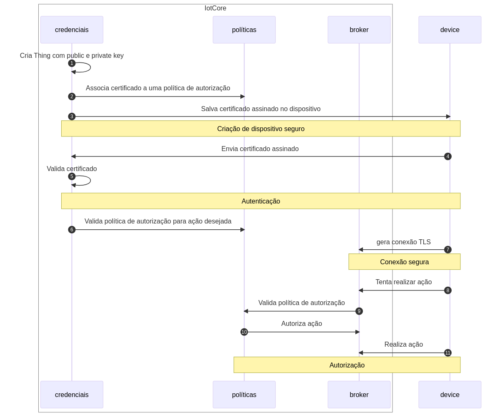

# Segurança e autenticação no IoT Core

A escolha da AWS como plataforma de nuvem é fundamentada na segurança avançada oferecida pela infraestrutura. Optamos por utilizar serviços gerenciados, como o AWS IoT Core, para garantir que a segurança seja priorizada desde o início. Se comparada à opção de um broker local, a AWS oferece vantagens significativas, minimizando potenciais vulnerabilidades exploráveis na tríade de Confidencialidade, Integridade e Disponibilidade (CIA).

## Por que não um broker local?

Consideramos inicialmente a opção de utilizar um broker local para gerenciar a comunicação entre os dispositivos e a nuvem. No entanto, essa escolha apresentava desafios significativos em termos de segurança, incluindo os seguintes:

**Força Bruta:** Em um cenário onde o broker local depende exclusivamente de autenticação por usuário e senha, existe a vulnerabilidade aos ataques de força bruta. Nesse tipo de ataque, um invasor tenta diversas combinações de nomes de usuário e senhas para obter acesso não autorizado ao broker. Para mitigar esse risco, seria necessário implementar políticas extras, acima do nível de biblioteca de broker MQTT, de bloqueio temporário após um número específico de tentativas mal-sucedidas e incentivar o uso de autenticação de dois fatores.

**Ataques de Intercepção de Dados:** A comunicação em um broker local pode ser mais suscetível a ataques de interceptação, nos quais um invasor tenta obter informações sensíveis durante a transmissão de dados entre os dispositivos e o broker. Ao contrário de comunicações totalmente criptografadas em ambientes online, a transmissão de dados em um ambiente local pode ocorrer em redes menos seguras, onde a falta de criptografia eficiente torna os dados mais acessíveis a potenciais invasores. Em cenários de interceptação, um atacante pode explorar vulnerabilidades na rede local para capturar e analisar pacotes de dados, expondo informações sensíveis durante a transferência. A implementação de protocolos de segurança robustos, como SSL/TLS, é crucial para mitigar esse risco, garantindo a criptografia dos dados em trânsito e dificultando a obtenção não autorizada de informações por parte de terceiros mal-intencionados.

**Ponto de Falha Único:** A concentração de todos os dados em um único ponto (o broker local) cria um ponto de falha único, tornando o sistema suscetível a ataques de negação de serviço. Os ataques DoS buscam sobrecarregar o serviço, comprometendo a disponibilidade e o desempenho. Para mitigar esse risco, estratégias de redundância, balanceamento de carga e implementação de medidas de segurança contra DoS são essenciais para garantir a continuidade do serviço, mesmo diante de tentativas maliciosas de sobrecarga.

Logo, as adaptações necessárias para garantir a segurança de um broker local nos levou a conclusão de que seria mais rápido e confiável simplesmente utilizar uma solução que já apresentasse essas features, isto é, a AWS IoT Core.

## Segurança na AWS



A segurança no AWS IoT Core é abordada por meio de uma série de componentes que trabalham em conjunto para garantir a integridade, autenticidade e confidencialidade dos dados. Vamos explorar detalhadamente cada componente:

**1. Certificados TLS (Transport Layer Security):** O Certificado TLS é essencial para garantir uma comunicação segura entre o dispositivo sensor e o AWS IoT Core. Este certificado é emitido por uma Autoridade Certificadora (CA) confiável, como a AWS Certificate Manager (ACM), e é utilizado para estabelecer a autenticidade do dispositivo.

**2. Chave Privada:** Cada dispositivo possui uma Chave Privada única associada ao seu certificado TLS. A Chave Privada é mantida de forma segura no dispositivo e é utilizada para assinar digitalmente as mensagens enviadas para o AWS IoT Core. Ela é crucial para verificar a identidade do dispositivo durante o processo de autenticação.

**3. Certificado do Root-CA:** O Certificado do Root-CA é emitido pela entidade raiz de confiança e é utilizado para validar a autenticidade do Certificado TLS do dispositivo. Este certificado é fundamental para garantir que a cadeia de confiança não foi comprometida. O Certificado do Root-CA é instalado previamente no dispositivo durante a fase de provisionamento.

### Processo de Autenticação

**1. Conexão Inicial:** Quando um dispositivo sensor tenta se conectar ao AWS IoT Core, ele apresenta seu Certificado TLS e a Chave Privada associada.

**2. Verificação de Certificado:** O AWS IoT Core verifica a autenticidade do Certificado TLS do dispositivo usando o Certificado do Root-CA. Se a cadeia de certificação estiver correta, o dispositivo é autenticado.

### Segurança contra Ataques

**Ataques de Man-in-the-Middle (MitM):** A utilização do TLS na comunicação protege contra ataques MitM, assegurando que a comunicação entre o dispositivo e o AWS IoT Core seja criptografada e autenticada.

**Falsificação de Identidade:** A autenticação baseada em certificados dificulta a falsificação de identidade, já que apenas dispositivos com certificados válidos emitidos por uma CA confiável são aceitos.

**Replay Attacks:** A inclusão de timestamps nos certificados ajuda a prevenir replay attacks, garantindo que os certificados expirados não sejam aceitos.

## Processo de autorização
As políticas de acesso desempenham um papel crucial na AWS IoT Core, controlando as permissões de dispositivos e clientes para acessar os recursos na nuvem. Essas políticas são elaboradas para definir quais ações são permitidas ou negadas, garantindo uma operação segura e eficiente do sistema. Vamos aprofundar nos principais aspectos das políticas de acesso:

### Controle do Nome do Client ID

As políticas no AWS IoT Core incorporam restrições ao nome do Client ID durante a fase de conexão. Essa medida evita potenciais tentativas de conexão de dispositivos maliciosos ou não autorizados, adicionando uma camada adicional de segurança.

```
{
    "Effect" : "Allow",
    "Action" : "iot:Connect",
    "Resource" : [
    "arn:aws:iot:${data.aws_arn.east_thing_arn.region}:${data.aws_arn.east_thing_arn.account}:client/*",
    ]
}
```

### Gerenciamento de Tópicos

Uma das funcionalidades-chave das políticas é o controle sobre tópicos de publicação e inscrição. Isso permite uma granularidade fina na definição de quais tópicos um dispositivo específico pode publicar ou assinar. O acesso é estritamente limitado aos tópicos necessários para as operações do dispositivo, minimizando os riscos associados à divulgação indevida de informações.

Nesse sentido, em nossa infraestrutura, sensores só podem se inscrever e publicar em tópicos associados à sua região. Por exemplo, para um sensor da zona oeste:

```
 {
    "Effect" : "Allow",
    "Action" : [
    "iot:Publish",
    "iot:Receive",
    "iot:PublishRetain"
    ],
    "Resource" : [
    "arn:aws:iot:${data.aws_arn.west_thing_arn.region}:${data.aws_arn.west_thing_arn.account}:topic/sensor/west/*",
    ]
},
{
    "Effect" : "Allow",
    "Action" : "iot:Subscribe",
    "Resource" : [
    "arn:aws:iot:${data.aws_arn.west_thing_arn.region}:${data.aws_arn.west_thing_arn.account}:topicfilter/sensor/west/*",
    ]
},
```

### Herança de Políticas

A AWS IoT Core permite a criação de políticas hierárquicas, facilitando a herança de permissões. Isso simplifica o gerenciamento de políticas, especialmente em ambientes com diversos dispositivos. A herança permite a aplicação de permissões com base em funções ou grupos, otimizando a administração de políticas de acesso.