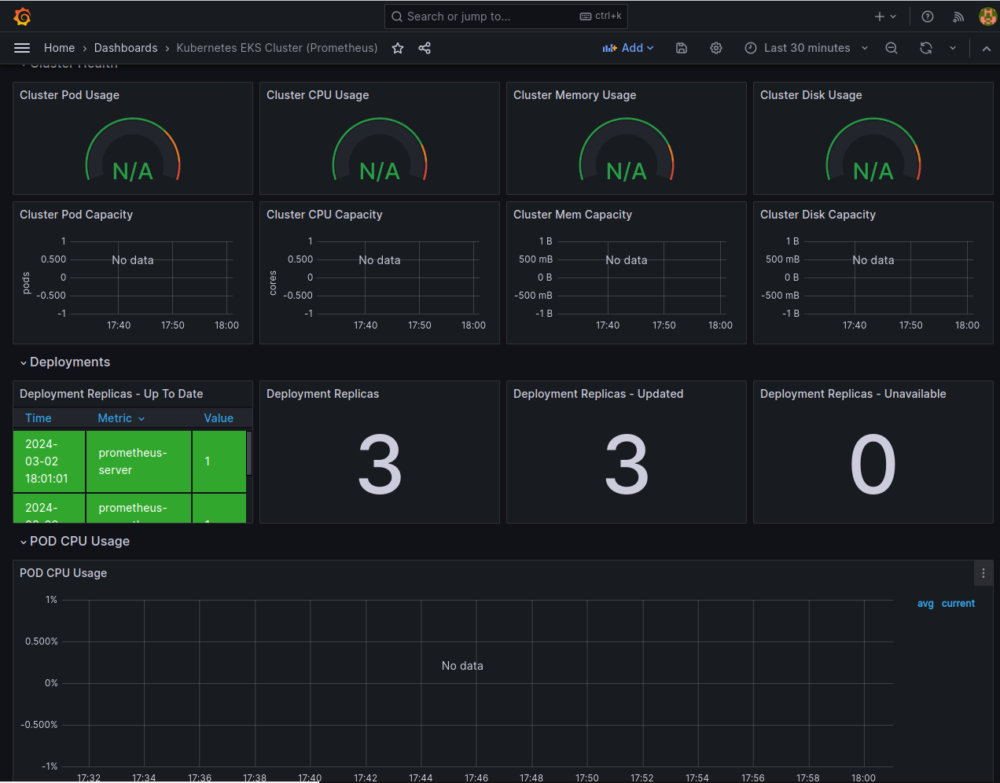

# Grafana e Prometheus

O Grafana e o Prometheus são ferramentas essenciais para a visualização e monitoramento de dados. O Grafana é uma plataforma de análise e visualização de métricas, enquanto o Prometheus é um sistema de monitoramento e alerta. Ambos são amplamente utilizados em ambientes de nuvem e são altamente integrados com a AWS.

## Configuração do Ambiente

Para instalar o Grafana e o Prometheus no Amazon EKS (Elastic Kubernetes Service), é necessário configurar o ambiente de acordo com as necessidades do projeto. Isso inclui a instalação do Helm, que é um gerenciador de pacotes para Kubernetes, e a criação de namespaces para o Grafana e o Prometheus. Além disso, é necessário configurar o acesso ao cluster do Amazon EKS, o que pode ser feito por meio do AWS CLI (Command Line Interface) e Kubectl, que é uma ferramenta de linha de comando para interagir com clusters Kubernetes. Os comandos a seguir mostram como instalar o Helm, AWS CLI e o Kubernetes CLI, e como configurar o acesso ao cluster do Amazon EKS.

```bash

curl "https://awscli.amazonaws.com/awscli-exe-linux-x86_64.zip" -o "awscliv2.zip"

unzip awscliv2.zip

sudo ./aws/install --bin-dir /usr/local/bin --install-dir /usr/local/aws-cli --update

aws --version

aws eks update-kubeconfig --name eks-prod

kubectl get pods

kubectl get namespaces
  
kubectl apply -f https://github.com/kubernetes-sigs/metrics-server/releases/latest/download/components.yaml
  
## Install EKS ctl
curl --silent --location "https://github.com/weaveworks/eksctl/releases/latest/download/eksctl_$(uname -s)_amd64.tar.gz" | tar xz -C /tmp
  
sudo mv /tmp/eksctl /usr/local/bin
  
eksctl create addon --name aws-ebs-csi-driver --cluster eks-prod --service-account-role-arn arn:aws:iam::<ID ACCount>:role/LabRole_EBS_CSI_DriverRole --force
  
## install helm 3 cli
curl -fsSL -o get_helm.sh https://raw.githubusercontent.com/helm/helm/main/scripts/get-helm-3
chmod 700 get_helm.sh
./get_helm.sh

```

**Nota**: Substitua `<ID ACCount>` pelo ID da sua conta da AWS. Na pasta `src/config` você encontra os arquivo `.sh` para instalação do `aws-cli` e `eksctl` e configuração do `kubeconfig` e `helm`, além de realizar a instalação do prometheus e grafana.

## Prometheus

O Prometheus é um sistema de monitoramento e alerta, que coleta métricas de sistemas e serviços e armazena essas métricas em um banco de dados de séries temporais. O Prometheus oferece suporte a uma ampla variedade de fontes de dados, incluindo AWS CloudWatch, JMX, StatsD, e muitas outras. Além disso, o Prometheus oferece suporte a alertas, o que permite definir regras de alerta com base nas métricas coletadas.

### Vantagens do Prometheus

O Prometheus oferece diversas vantagens em relação a outras ferramentas de monitoramento, tais como:
- **Coleta de Métricas de Sistemas e Serviços**: O Prometheus coleta métricas de sistemas e serviços, incluindo CPU, memória, disco, rede, e muitas outras, o que permite monitorar o desempenho e a disponibilidade dos sistemas e serviços.
- **Armazenamento de Métricas em Banco de Dados de Séries Temporais**: O Prometheus armazena as métricas coletadas em um banco de dados de séries temporais, o que permite consultar e analisar as métricas ao longo do tempo.
- **Suporte a Alertas**: O Prometheus oferece suporte a alertas, o que permite definir regras de alerta com base nas métricas coletadas, e notificar os usuários quando as regras são acionadas.

### Intalação do Prometheus

A instalação do Prometheus é simples e pode ser feita em diversas plataformas, incluindo Linux, Windows, macOS, Docker, Kubernetes, e muitas outras. No caso do Amazon EKS (Elastic Kubernetes Service), o Prometheus pode ser instalado diretamente no cluster do EKS, o que permite coletar métricas de sistemas e serviços e armazená-las em um banco de dados de séries temporais. Para instalar o Prometheus no Amazon EKS, basta executar o seguinte comando:

```bash
## runnig helm 
helm repo add prometheus-community https://prometheus-community.github.io/helm-charts
  
helm repo update
  
helm repo list
  
kubectl create namespace prometheus
  
cd ../../infrastructure/charts
  
helm install prometheus prometheus-community/prometheus \
    --namespace prometheus \
    --set alertmanager.persistentVolume.storageClass="gp2" \
    --set server.persistentVolume.storageClass="gp2" \
    --values prometheus/values.yaml
	
	
kubectl get all -n prometheus

kubectl port-forward deployment/prometheus-server 9090:9090 -n prometheus

helm repo add grafana https://grafana.github.io/helm-charts

helm repo update

```

## Grafana

O Grafana é uma plataforma de análise e visualização de métricas, que permite criar, explorar e compartilhar dashboards e dados. O Grafana oferece suporte a uma ampla variedade de fontes de dados, incluindo Prometheus, AWS CloudWatch, Elasticsearch, InfluxDB, MySQL, PostgreSQL, e muitas outras. Além disso, o Grafana oferece suporte a plugins, o que permite estender suas funcionalidades e integrá-lo com outros sistemas.

### Vantagens do Grafana

O Grafana oferece diversas vantagens em relação a outras ferramentas de visualização de métricas, tais como:
- **Suporte a Diversas Fontes de Dados**: O Grafana oferece suporte a uma ampla variedade de fontes de dados, o que permite integrá-lo com sistemas e serviços de monitoramento.
- **Flexibilidade e Customização**: O Grafana oferece uma interface intuitiva e flexível para a criação e customização de dashboards, permitindo criar visualizações personalizadas e adaptadas às necessidades do usuário.
- **Integração com Outras Ferramentas**: O Grafana oferece suporte a plugins, o que permite estender suas funcionalidades e integrá-lo com outros sistemas, como Prometheus, AWS CloudWatch, Elasticsearch e muitas outras.
- **Comunidade Ativa e Suporte**: O Grafana tem uma comunidade ativa e crescente, o que significa uma grande quantidade de recursos de aprendizado, plugins compartilhados e suporte quando você precisa de ajuda.
- **Escalabilidade e Desempenho**: O Grafana é projetado para lidar com grandes volumes de dados e oferece suporte a ambientes de nuvem, o que permite escalar e dimensionar a plataforma conforme necessário.
- **Open Source e Licença Apache 2.0**: O Grafana é um software de código aberto e é distribuído sob a licença Apache 2.0, o que significa que é gratuito para uso comercial e não comercial.

### Intalação do Grafana

A instalação do Grafana é simples e pode ser feita em diversas plataformas, incluindo Linux, Windows, macOS, Docker, Kubernetes, e muitas outras. No caso do Amazon EKS (Elastic Kubernetes Service), o Grafana pode ser instalado diretamente no cluster do EKS, o que permite visualizar e analisar as métricas coletadas pelo Prometheus. Para instalar o Grafana no Amazon EKS, basta executar o seguinte comando:

```bash
cd infrastructure/charts

helm repo add grafana https://grafana.github.io/helm-charts

helm repo update

kubectl create namespace grafana
	
helm install grafana grafana/grafana \
    --namespace grafana \
    --set persistence.storageClassName="gp2" \
    --set persistence.enabled=true \
    --set adminPassword='grafana' \
    --values grafana/values.yaml \
    --set service.type=LoadBalancer
	
kubectl get all -n grafana

kubectl get svc grafana -n grafana -o jsonpath='{.status.loadBalancer.ingress[0].ip}'

kubectl get svc -n grafana
```

## Integração do Grafana com o Prometheus

O Grafana e o Prometheus são altamente integrados, o que permite visualizar e analisar as métricas coletadas pelo Prometheus por meio de dashboards personalizados. O Grafana oferece suporte nativo ao Prometheus, o que significa que é possível configurar o Prometheus como uma fonte de dados no Grafana e criar dashboards com base nas métricas coletadas pelo Prometheus.

### Vantagens da Integração

A integração do Grafana com o Prometheus oferece diversas vantagens, tais como:
- **Visualização e Análise de Métricas**: O Grafana oferece uma interface intuitiva e flexível para a visualização e análise de métricas coletadas pelo Prometheus, o que permite criar dashboards personalizados e adaptados às necessidades do usuário.
- **Alertas e Notificações**: O Grafana oferece suporte a alertas e notificações, o que permite definir regras de alerta com base nas métricas coletadas pelo Prometheus, e notificar os usuários quando as regras são acionadas.

## Motivo de Uso

O grupo decidiu adotar o Grafana e o Prometheus para visualização e análise dos dados coletados. Essa escolha foi motivada pelo robusto suporte de integração via SDK com a AWS, facilitando a coleta de métricas de sistemas e serviços. A integração se beneficia da autoconfiguração de acesso (não havendo a necessidade de cadastrar as credencias da AWS), um recurso particularmente vantajoso no contexto do EKS (Elastic Kubernetes Service). Como o EKS gerencia os pods, a instalação do Grafana e do Prometheus diretamente sobre ele elimina a necessidade de configurações manuais de acesso. Isso é possível porque o próprio EKS automatiza a configuração de acesso, simplificando significativamente o processo de implementação e gestão dessas ferramentas de monitoramento. 

## Exemplo de Dashboard

O dashboard a seguir é um exemplo de como as métricas coletadas pelo Prometheus podem ser visualizadas e analisadas por meio do Grafana. O dashboard inclui gráficos de séries temporais, tabelas, e outros tipos de visualizações, que permitem monitorar o desempenho e a disponibilidade dos pods e serviços do cluster do Amazon EKS.




## Demo do Grafana e Prometheus

A seguir, um vídeo demonstrativo de como o Grafana e o Prometheus podem ser utilizados para visualizar e analisar métricas coletadas de sistemas e serviços. O vídeo inclui uma demonstração de como configurar um novo data source no Grafana, criar um novo dashboard, e adicionar visualizações de métricas coletadas pelo Prometheus, incluindo o dashboard construido para demonstração de dados de sensores da região norte.

<iframe width="560" height="315" src="https://www.youtube.com/embed/j9ltPLv8gIc" frameborder="0" allow="accelerometer; autoplay; clipboard-write; encrypted-media; gyroscope; picture-in-picture" allowfullscreen></iframe>
