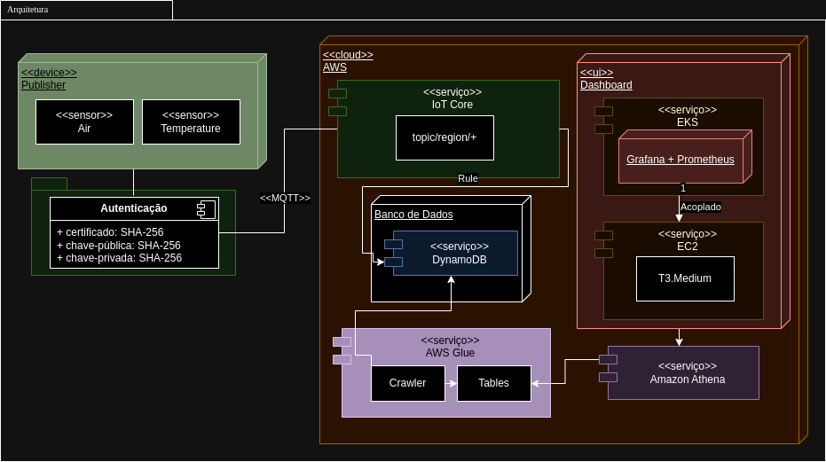
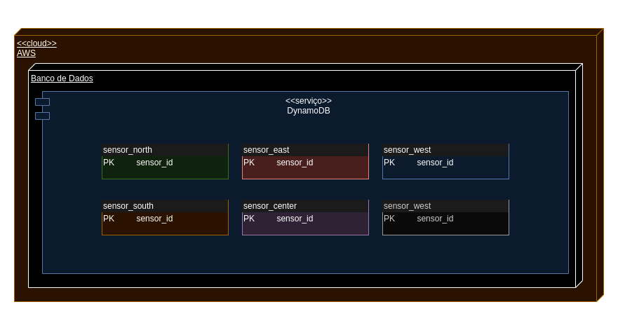
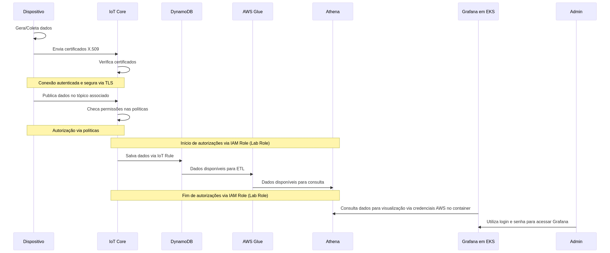

# Visão geral do sistema

A solução proposta é uma arquitetura IoT robusta que utiliza serviços gerenciados da AWS para coletar, processar e visualizar dados provenientes de dispositivos IoT simulados. Essa solução é composta por vários componentes interconectados, cada um desempenhando um papel fundamental no fluxo de dados. Vamos explorar brevemente cada componente para entender como a solução opera.

## Diagrama de Blocos da Arquitetura - v3.0

### Descrição dos Componentes Anteriores

- **Cliente MQTT**: Dispositivo que publica mensagens em tópicos MQTT. No contexto do projeto, o cliente MQTT é um simulador de um dispositivo IoT.
- **Broker MQTT**: Servidor que gerencia a comunicação entre os clientes MQTT. No contexto do projeto, o broker MQTT é o serviço AWS IoT Core. A escolha do Iot Core se deu pela sua escalabilidade, segurança e integração com outros serviços da AWS, ao qual no próprio processo de configuração de um dispositivo, é possível criar regras para processar mensagens e armazená-las em outros serviços.
- **AWS IoT Core**: Serviço da AWS que gerencia a comunicação entre dispositivos IoT e a nuvem. O AWS IoT Core permite a conexão segura de dispositivos com a nuvem, além de oferecer recursos para processar e armazenar mensagens.
- **DynamoDB**: Banco de dados NoSQL da AWS que armazena as mensagens recebidas do broker MQTT. O DynamoDB foi escolhido por sua escalabilidade, desempenho e integração com outros serviços da AWS.
- **Amazon EKS**: Serviço da AWS que gerencia clusters de contêineres. O EKS foi escolhido para hospedar a aplicação web por sua escalabilidade, segurança e integração com outros serviços da AWS.
- **EC2**: Serviço da AWS que fornece capacidade de computação na nuvem. O EC2 foi escolhido para estar acoplado ao EKS e hospedar os nós do Kubernetes e seus respectivos pods.

### Descrição dos Componentes Adicionados

- **AWS Glue**: Serviço da AWS que oferece recursos para preparar e carregar dados para análise. O AWS Glue executa a rotina de tratamento e catalogação dos dados do DynamoDB por meio do AWS Glue ETL para o AWS Glue Data Catalog.
  - **AWS Glue ETL**: Serviço da AWS que oferece recursos para extrair, transformar e carregar dados para análise. O AWS Glue ETL foi escolhido para extrair, transformar e carregar os dados do DynamoDB para o AWS Glue Data Catalog.
  - **AWS Glue Data Catalog**: Serviço da AWS que oferece recursos para catalogar e armazenar metadados de dados. O AWS Glue Data Catalog foi escolhido para armazenar os metadados dos dados extraídos, transformados e carregados do DynamoDB.
  
## Diagrama de implantação

Um Diagrama UML (Unified Modeling Language ou Linguagem Unificada de Modelagem) é uma forma padronizada de visualizar o design de um sistema. UML é uma linguagem de modelagem de sistemas que permite a representação gráfica de um sistema por meio de diferentes tipos de diagramas. Com a UML, os desenvolvedores e stakeholders podem entender, alterar, construir e documentar aspectos de um sistema de software.

### Dispositivo (Publisher)

- O dispositivo contém sensores para coletar dados ambientais como qualidade do ar e temperatura.
- A autenticação é garantida por meio de certificados SHA-256 e chaves (pública e privada) SHA-256 para comunicação segura.
- Os dados coletados são enviados para a AWS através do protocolo MQTT.
  
### Nuvem (AWS)
- No serviço AWS IoT Core, uma regra é definida para processar dados recebidos do tópico 'topic/region/+'.
- O AWS IoT Core atua como um ponto central para receber e encaminhar dados.
  
### Banco de Dados
- Os dados são armazenados no DynamoDB, um banco de dados NoSQL da AWS, para armazenamento e recuperação eficiente.
- O serviço AWS Glue é usado para realizar a catalogação dos dados armazenados, executando funções de um Crawler para identificar os dados e organizar as tabelas para consulta.

### Visualização (Dashboard)

- O serviço EKS (Elastic Kubernetes Service) gerencia os aplicativos de visualização de dados.
- Grafana e Prometheus são integrados para a monitorização e visualização em tempo real dos dados.
- O Amazon Athena é usado para consultas SQL diretamente no DynamoDB.
- O serviço EC2, com uma instância T3.Medium, é utilizado para hospedar e executar as aplicações necessárias para o funcionamento do dashboard.

## Diagrama de banco de dados

