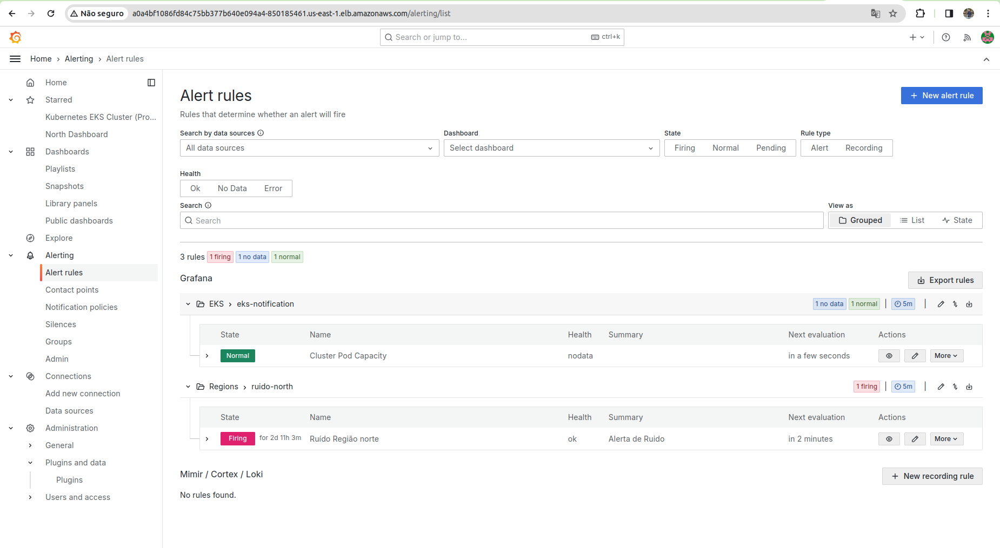
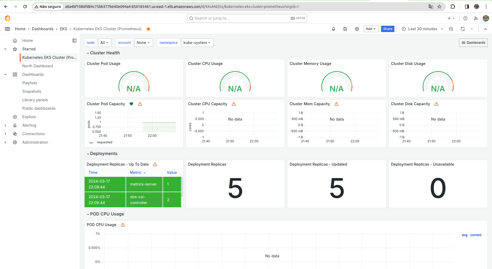
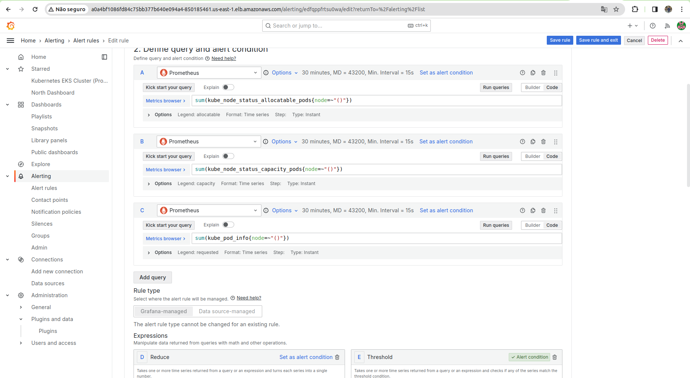
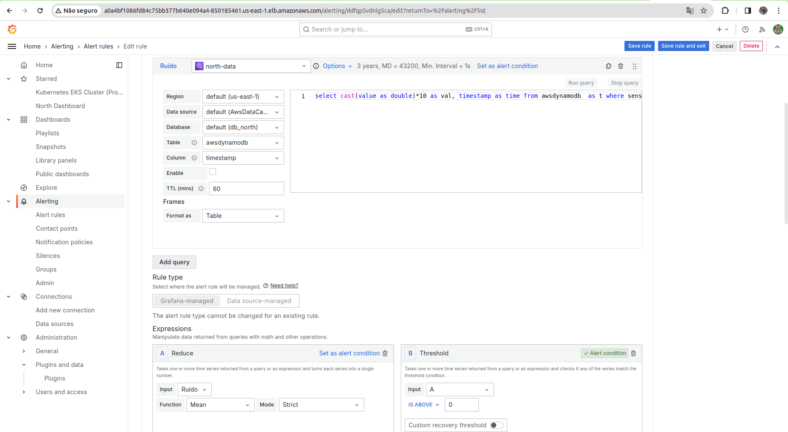

# Configuração de Alarmes

Os alarmes no Grafana são uma forma de monitorar o comportamento de uma métrica e ser notificado quando ela atinge um valor crítico. Isso é muito útil para monitorar o comportamento de um sistema e ser notificado quando algo não está funcionando como esperado.

## Tipos de Alarmes

O Grafana oferece uma ampla gama de opções de configuração para alarmes, permitindo que os usuários monitorem uma variedade de métricas e condições. Sendo alguns dos tipos de alarmes mais comuns:

- **Threshold Alarms**: Alarmes de limite são os mais comuns e são acionados quando uma métrica ultrapassa um valor específico.

    **Uso:** Muito útil para monitorar cargas de CPU, uso de memória, espaço em disco, e latência de rede.

- **Anomaly Detection Alarms**: Esses alarmes usam algoritmos de detecção de anomalias para identificar padrões incomuns que podem indicar problemas.
  
    **Uso:** Ideal para detectar comportamentos inesperados em aplicações e sistemas que podem não ser capturados por limites estáticos.

- **Rate of Change Alarms**: São acionados com base na velocidade de mudança de uma métrica, ao invés de seu valor absoluto.
  
    **Uso**: Importante para identificar picos súbitos ou quedas em métricas que podem indicar eventos significativos, como um aumento repentino no tráfego de rede.

## Alarmes Implementados

Durante a Sprint 3, o grupo se concentrou no desenvolvimento de um dashboard específico para a região `Norte`, com o objetivo de visualizar os dados pertinentes a essa área geográfica. De maneira similar, a configuração de `alertas` foi direcionada para os gráficos de séries temporais criados, com o intuito de notificar os usuários sobre informações críticas. Além de estabelecer alertas para o Dashboard da região `Norte`, o grupo também se dedicou ao desenvolvimento de mecanismos de alerta para o monitoramento dos pods no `EKS`, aproveitando o fato de que tanto o Grafana quanto o Prometheus estão instalados e operando neste serviço da AWS.

Na imagem acima é possível visualizar o painel de alertas do Grafana, onde é possível configurar os alertas para os gráficos de séries temporais. A seguir, são apresentados os dashboards desenvolvidos e os alarmes implementados.

### Dashboard de Monitoramento do EKS

Como mencionado anteriormente, o grupo também dedicou-se ao desenvolvimento de mecanismos de alerta para monitorar os pods no `EKS`. A seguir, apresentamos o dashboard desenvolvido para este propósito.

O desenvolvimento do dashboard de monitoramento do `EKS` teve como objetivo possibilitar a visualização dos dados relevantes a esse serviço da AWS. Contudo, apenas a criação de um dashboard não é suficiente para assegurar que os usuários sejam notificados sobre informações críticas. Por essa razão, o grupo empenhou-se na configuração de alertas para este dashboard, garantindo que os usuários sejam informados sobre questões críticas, conforme ilustrado na imagem abaixo:

Na imagem acima, é possível observar uma regra de alerta que monitora o status dos nós alocados no EKS, o estado de cada pod e, finalmente, as informações dos pods em execução no EKS, gerando uma notificação quando algo não está funcionando conforme o esperado. Além de marcar o gráfico com um ponto vermelho ou um aviso, o alerta também envia uma notificação.

### Dashboard North

Já para o dashboard da região `Norte`, o grupo também se dedicou à configuração de alertas para os gráficos de séries temporais criados. A seguir, apresentamos o dashboard desenvolvido para este propósito.

Na primeira versão do dashboard, o foco foi a visualização de dados específicos da região `North`, visando monitorar uma métrica específica e emitir notificações quando valores críticos fossem alcançados. A configuração de alertas neste dashboard concentrou-se nos gráficos de séries temporais, objetivando informar os usuários sobre situações críticas, como ilustrado na imagem anterior. Apesar de a configuração de alertas ainda estar em aprimoramento, o grupo está dedicado a assegurar a comunicação efetiva de informações críticas, utilizando também consultas personalizadas para criar alertas mais precisos e diversificados.

## Criação de Alarmes

Criar alarmes em gráficos de séries temporais no Grafana é um processo direto que pode ajudar a equipe de operações a monitorar a saúde de sistemas e aplicativos em tempo real. A seguir, passo a passo para configurar alarmes em gráficos de séries temporais no Grafana:

### Pré-Requisitos

- Ter o Grafana instalado e configurado.
- Acesso a uma fonte de dados compatível (ex.: Prometheus, Athena).

### Passo 1: Crie um Painel

1. Faça login na sua instância do Grafana.
2. No menu lateral, clique em `+` e selecione `Dashboard`.
3. Clique em `Add new panel` para adicionar um novo painel ao dashboard.

### Passo 2: Selecione a Fonte de Dados e Configure a Query

1. No editor do painel, selecione sua fonte de dados do menu dropdown.
2. Configure a query para puxar os dados desejados para o gráfico de séries temporais. Por exemplo, se estiver usando Prometheus, você pode digitar uma expressão como `rate(http_requests_total[5m])` para medir a taxa de solicitações HTTP por segundo nos últimos 5 minutos.
3. Visualize os dados no gráfico para garantir que a query está correta.

### Passo 3: Configure o Alarme

1. Na aba do editor do painel, clique em `Alert`.
2. Clique em `Create Alert`. Isso abrirá o editor de alertas.
3. Dê um nome ao seu alerta e configure os seguintes parâmetros:
   - **Condition:** Defina a condição que acionará o alarme. Por exemplo, você pode configurar para acionar quando o valor médio da query nos últimos 5 minutos for maior que 100.
   - **Evaluation Interval:** Defina com que frequência o Grafana avaliará a condição do alarme.
   - **For:** (Opcional) Configure por quanto tempo a condição deve ser verdadeira antes de disparar o alarme.
4. Em `Notification`, clique em `Add Notification Channel` para definir como você quer ser notificado. Você pode escolher entre várias opções, como email, Slack, Webhook, etc.
5. Configure os detalhes do seu canal de notificação conforme necessário.

### Passo 4: Salve o Painel e Teste o Alarme

1. Clique em `Apply` para voltar ao dashboard.
2. Salve o dashboard com o novo painel.
3. Teste o alarme gerando as condições definidas para o disparo. Você pode, por exemplo, aumentar a carga no seu sistema se o alarme for baseado em carga de CPU ou taxa de solicitações HTTP.

### Considerações Finais

- Certifique-se de que a frequência da avaliação do alarme e o período de tempo configurado para a condição (`For`) sejam adequados para a natureza da métrica que você está monitorando.
- Utilize os canais de notificação para garantir que as equipes certas sejam alertadas rapidamente sobre problemas potenciais.
- Monitore o desempenho do alarme e ajuste as condições conforme necessário para evitar alarmes falsos ou para garantir que nenhum problema real passe despercebido.

## Conclusão

A configuração de alertas no Grafana é uma funcionalidade crucial que possibilita o monitoramento de métricas específicas, emitindo notificações quando valores críticos são atingidos. Embora seja possível configurar diversos tipos de alertas, é essencial que a equipe de operações fique vigilante quanto à frequência de verificação dos alertas e ao intervalo de tempo estabelecido para as condições de disparo. Isso assegura que as equipes adequadas sejam prontamente informadas sobre quaisquer problemas potenciais. Ademais, monitorar a eficácia dos alertas e ajustar as condições conforme necessário é vital para minimizar alarmes falsos e garantir que problemas reais sejam detectados e tratados de maneira eficiente.