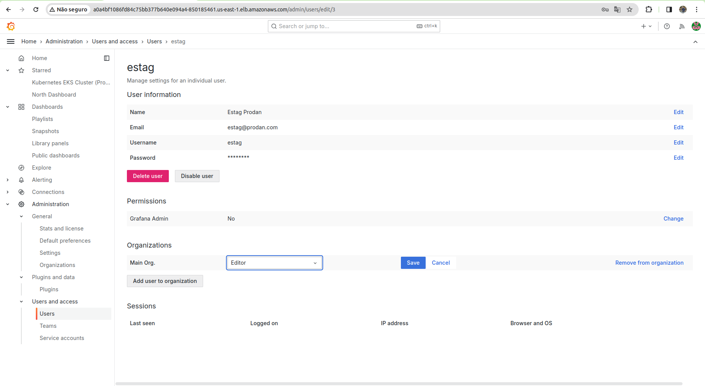

# Controle de Usuários

O controle de usuários é uma funcionalidade essencial para garantir a segurança e a integridade dos dados. Através do controle de usuários, é possível gerenciar quem tem acesso ao sistema e quais permissões eles possuem. Isso é fundamental para garantir que apenas pessoas autorizadas possam acessar e manipular os dados, evitando assim possíveis problemas de segurança.

## Controle de Acesso no Grafana

O Grafana oferece um sistema de controle de acesso robusto e flexível, que permite a criação de usuários e a definição de permissões para cada um deles. Através do Grafana, é possível criar usuários com diferentes níveis de acesso sendo eles: `admin`, `editor` e`viewer`, garantindo que cada pessoa tenha apenas as permissões necessárias para realizar suas tarefas.

### Granafa - Admin

O usuário `admin` é o usuário com permissões mais elevadas no Grafana. Ele tem acesso total ao sistema e pode realizar qualquer operação, incluindo a criação de novos usuários, a definição de permissões e a configuração de alarmes. O usuário `admin` é responsável por garantir que o sistema esteja configurado corretamente e que apenas pessoas autorizadas tenham acesso aos dados.

### Granafa - Editor

O usuário `editor` é um usuário com permissões limitadas no Grafana. Ele tem acesso apenas a algumas funcionalidades do sistema e não pode realizar operações críticas, como a criação de novos usuários ou a definição de permissões. O usuário `editor` é responsável por realizar tarefas específicas, como a visualização de dados e a configuração de alarmes, mas não tem permissão para realizar operações que possam comprometer a segurança do sistema.

### Granafa - Viewer

O usuário `viewer` é um usuário com permissões ainda mais limitadas no Grafana. Ele tem acesso apenas à visualização de dados e não pode realizar nenhuma operação no sistema. O usuário `viewer` é responsável por visualizar os dados e relatórios, mas não tem permissão para realizar nenhuma operação que possa comprometer a segurança do sistema.

## Vantagens do Controle de Usuários

O controle de usuários oferece várias vantagens para o sistema, incluindo:

# Vantagens do Controle de Acesso a Usuário no Grafana

O Grafana é uma plataforma de análise e visualização de dados amplamente utilizada, conhecida por sua flexibilidade e capacidade de integrar diversas fontes de dados. Um dos recursos críticos que aprimoram sua funcionalidade é o controle de acesso a usuários. Este recurso oferece várias vantagens que facilitam a gestão de equipes e a segurança dos dados. Algumas das principais vantagens incluem:

**Segurança Reforçada**

- **Controle Granular de Acesso:** Permite definir permissões específicas para diferentes usuários ou grupos, garantindo que cada usuário tenha acesso apenas aos dados e às funcionalidades necessárias.
- **Restrição de Acesso a Dados Sensíveis:** Ajuda a proteger dados confidenciais ao limitar o acesso com base em roles e responsabilidades.

**Gestão Eficiente de Equipes**

- **Flexibilidade na Atribuição de Papéis:** Os administradores podem atribuir papéis predefinidos, como Viewer, Editor e Admin, que facilitam a gestão de permissões sem complicações.
- **Acesso Baseado em Equipe:** Facilita a colaboração ao permitir o agrupamento de usuários em equipes, com permissões de acesso definidas coletivamente.

**Personalização de Experiência**

- **Ambientes Personalizados:** Usuários podem ter experiências personalizadas com dashboards e alertas que se ajustam às suas necessidades e permissões.
- **Filtragem de Dados:** O acesso restrito permite que os usuários vejam apenas os dados relevantes para suas funções, tornando as análises mais focadas e eficientes.

**Conformidade e Auditoria**

- **Trilha de Auditoria:** Facilita o cumprimento de normas de conformidade ao registrar quem acessou quais dados e quando, permitindo uma revisão detalhada das atividades dos usuários.
- **Gestão de Conformidade:** Assegura que o acesso aos dados esteja em conformidade com políticas internas e regulamentações externas.

**Facilidade de Administração**

- **Interface Intuitiva:** A gestão de usuários e equipes é feita por meio de uma interface de usuário clara e intuitiva, simplificando a administração do sistema.
- **Integração com Provedores de Identidade:** Suporta a integração com sistemas de gerenciamento de identidade e acesso, como LDAP e OAuth, facilitando a gestão de autenticações e autorizações.

## Criação de Usuários

A criação de novos usuários no Grafana é um processo simples e direto, permitindo que você adicione novos membros à sua equipe e configure seus níveis de acesso. A seguir, um guia passo a passo para criar um novo usuário no Grafana:

### 1. Acessar o Painel Administrativo

- Faça login no Grafana como administrador.
- No canto esquerdo da tela, clique no ícone de engrenagem (⚙️) para acessar o menu `Configuração`.

### 2. Navegar até a Gestão de Usuários

- Dentro do menu de `Configuração`, localize e clique em `Usuários`. Isso o levará à página de gestão de usuários, onde você pode ver todos os usuários atuais e adicionar novos.

### 3. Adicionar um Novo Usuário

- Na página de usuários, clique no botão `Novo usuário`, geralmente encontrado no canto superior direito.
- Será apresentado um formulário para inserir os detalhes do novo usuário.

### 4. Preencher os Detalhes do Usuário

- **Email:** Insira o endereço de e-mail do usuário. Este será o login do usuário.
- **Nome:** Forneça o nome do usuário.
- **Nome de Usuário:** Especifique um nome de usuário. Este campo é opcional e, se deixado em branco, o e-mail será usado como nome de usuário.
- **Senha:** Defina uma senha para a conta do usuário.

### 5. Configurar o Nível de Acesso

- **Permissão:** Escolha o nível de acesso para o novo usuário. As opções geralmente incluem `Viewer` (Visualizador), `Editor` (Editor) e `Admin` (Administrador). Esses níveis determinam o que o usuário pode ver e fazer dentro do Grafana. Por padrão o nível de acesso é `Viewer`.

### 6. Salvar o Novo Usuário

- Após preencher todos os detalhes, clique no botão `Salvar` para criar o novo usuário.

## Mudança de Tipo de Usuário

O próprio Grafana permite que o administrador do sistema altere o tipo de usuário, ou seja, o nível de permissão de um usuário. Isso é útil quando um usuário muda de função na organização e precisa de mais ou menos permissões para realizar suas tarefas. Por exemplo, se um usuário que era `editor` passa a ser `admin`, o administrador do sistema pode alterar o tipo de usuário para refletir essa mudança. Para realizar essa alteração, o administrador do sistema deve seguir os seguintes passos:

### Passo 1: Acessar o Grafana

1. **Login:** Faça login no Grafana usando suas credenciais administrativas.

### Passo 2: Navegar até a Administração de Usuários

1. **Menu Lateral:** No menu lateral, clique no ícone de engrenagem (⚙️) para acessar as configurações.
2. **Usuários:** Selecione "Usuários" na lista de opções disponíveis para acessar a administração de usuários.

### Passo 3: Localizar o Usuário

1. **Lista de Usuários:** Você verá uma lista de todos os usuários cadastrados no sistema.
2. **Pesquisar Usuário:** Use a barra de pesquisa para encontrar o usuário específico que você deseja editar.

### Passo 4: Editar Tipo de Acesso do Usuário

1. **Acessar Configurações do Usuário:** Clique no nome do usuário que você deseja editar para acessar suas configurações.
2. **Alterar Função:** Na seção de detalhes do usuário, localize a opção "Função" ou "Role". Aqui, você pode selecionar o novo tipo de acesso que deseja atribuir ao usuário. As opções geralmente incluem:
   - Viewer (Visualizador)
   - Editor (Editor)
   - Admin (Administrador)

### Passo 5: Salvar Alterações

1. **Salvar:** Após selecionar o novo tipo de acesso, clique no botão "Salvar" para aplicar as alterações.

### Passo 6: Verificação (Opcional)

1. **Confirmar Alterações:** Para garantir que as alterações foram aplicadas corretamente, você pode navegar até o perfil do usuário e verificar se o novo tipo de acesso está sendo exibido corretamente.

## Conclusão

O controle de acesso a usuários no Grafana não apenas fortalece a segurança dos dados e a conformidade regulatória, mas também melhora a eficiência operacional, a colaboração entre equipes e a personalização da experiência do usuário. Tais benefícios são fundamentais para organizações que buscam otimizar o uso de suas plataformas de visualização de dados de maneira segura e eficaz.