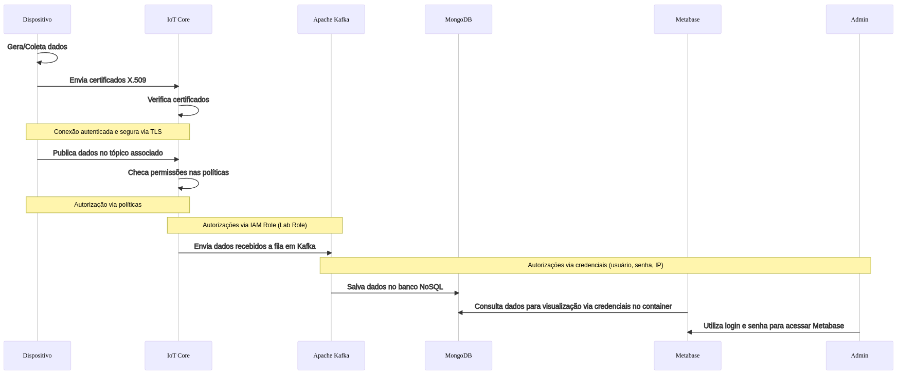

# Visão geral do sistema

A solução proposta é uma arquitetura IoT robusta que utiliza serviços gerenciados da AWS para coletar, processar e visualizar dados provenientes de dispositivos IoT simulados. Essa solução é composta por vários componentes interconectados, cada um desempenhando um papel fundamental no fluxo de dados. Vamos explorar brevemente cada componente para entender como a solução opera.

## Diagrama de Blocos da Arquitetura - v5.0

### Descrição dos Componentes Anteriores

- **Cliente MQTT**: Dispositivo que publica mensagens em tópicos MQTT. No contexto do projeto, o cliente MQTT é um simulador de um dispositivo IoT.
- **Broker MQTT**: Servidor que gerencia a comunicação entre os clientes MQTT. No contexto do projeto, o broker MQTT é o serviço AWS IoT Core. A escolha do Iot Core se deu pela sua escalabilidade, segurança e integração com outros serviços da AWS, ao qual no próprio processo de configuração de um dispositivo, é possível criar regras para processar mensagens e armazená-las em outros serviços.
- **AWS IoT Core**: Serviço da AWS que gerencia a comunicação entre dispositivos IoT e a nuvem. O AWS IoT Core permite a conexão segura de dispositivos com a nuvem, além de oferecer recursos para processar e armazenar mensagens.
- **Amazon EC2**: Serviço da AWS que fornece capacidade de computação na nuvem. O EC2 foi escolhido para hospedar o nosso novo dashboard através de um contâiner Docker juntamente com um Load Balance.

### Novos Componentes
- **Amazon Simple Queue Service (SQS)**: Serviço de mensagens gerenciado da AWS que permite a comunicação entre diferentes partes de um sistema. O SQS foi escolhido para criar uma fila de mensagens entre o AWS IoT Core e o AWS Lambda para garantir a entrega de mensagens.
- **AWS Lambda**: Serviço da AWS que permite a execução de código sem a necessidade de provisionar ou gerenciar servidores. O Lambda foi escolhido para processar as mensagens recebidas pelo AWS IoT Core e enviá-las para o Confluent Cloud.
- **Confluent Cloud**: Serviço de streaming de dados gerenciado que permite a ingestão, transformação e armazenamento de dados em tempo real. O Confluent Cloud foi escolhido para processar e armazenar os dados coletados dos dispositivos IoT.
- **MongoDB Atlas**: Serviço de banco de dados gerenciado que permite o armazenamento de dados em nuvem. O MongoDB Atlas foi escolhido para armazenar os dados processados pelo Confluent Cloud.
- **Amazon Elastic Load Balancer(ELB)**: Serviço de distribuição de tráfego de rede para aprimorar a escalabilidade da aplicação(nosso dashboard). O Load Balancer foi escolhido para melhorar a escalabilidade e estabilidade do nosso dashboard com uma grande quantidade de acessos simultâneos.

## Diagrama de Implantação - v3.0

Um Diagrama UML (Unified Modeling Language ou Linguagem Unificada de Modelagem) é uma forma padronizada de visualizar o design de um sistema. UML é uma linguagem de modelagem de sistemas que permite a representação gráfica de um sistema por meio de diferentes tipos de diagramas. Com a UML, os desenvolvedores e stakeholders podem entender, alterar, construir e documentar aspectos de um sistema de software.

### Dispositivo (Publisher)

- O dispositivo contém sensores para coletar dados ambientais como qualidade do ar e temperatura.
- A autenticação é garantida por meio de certificados SHA-256 e chaves (pública e privada) SHA-256 para comunicação segura.
- Os dados coletados são enviados para a AWS através do protocolo MQTT.

### Nuvem (AWS)

- No serviço AWS IoT Core, uma regra é definida para processar dados recebidos do tópico 'topic/region/+'.
- O AWS IoT Core atua como um ponto central para receber e encaminhar dados.

### Processamento de Dados (AWS Lambda)
- O AWS Lambda é acionado pela SQS para processar os dados recebidos do AWS IoT Core.
- O AWS Lambda envia os dados para o Confluent Cloud para processamento e armazenamento.

### Processamento de Dados (Confluent Cloud)

- O Confluent Cloud é usado para processar e armazenar os dados recebidos do AWS Lambda.
- Esses dados são armazenados no MongoDB Atlas para consulta e análise.

### Banco de Dados (MongoDB)

- Os dados são armazenados no MongoDB, um banco de dados NoSQL, para armazenamento e recuperação eficiente.

### Visualização (Dashboard)

- Metabase é integrado para a monitorização, visualização e importação em tempo real dos dados.
- O MongoDB Atlas é consultado para obter dados para exibição no dashboard.
- O serviço Amazon EC2, com uma instância T3.Medium, é utilizado para hospedar e executar as aplicações necessárias para o funcionamento do dashboard.

## Segurança no banco de dados e dashboard

Para garantir a segurança nas conexões entre o banco de dados, o dashboard e o resto do sistema em nossa solução de arquitetura IoT baseada na AWS, implementamos diversas medidas de segurança. Abaixo estão os detalhes de como cada segmento da arquitetura contribui para a integridade, confidencialidade e disponibilidade dos dados e serviços.

### Segurança do Dispositivo ao AWS IoT Core

A segurança da comunicação entre dispositivos IoT e o AWS IoT Core é assegurada pelo uso do protocolo TLS (Transport Layer Security), o que garante uma conexão autenticada e segura. Cada dispositivo utiliza um certificado X.509 para estabelecer sua identidade, o qual é verificado pelo AWS IoT Core antes de qualquer comunicação. Além disso, políticas de autorização específicas são aplicadas para restringir o que cada dispositivo pode fazer (como publicar ou assinar tópicos MQTT específicos).

### Autorização e Controle de Acesso

Utilizamos o AWS Identity and Access Management (IAM) para gerenciar as permissões de acesso aos recursos da AWS. O IAM Role, ou papel do IAM, começa com a definição de políticas que especificam quais serviços e ações o usuário ou serviço tem permissão para usar.

### Segurança no Banco de Dados

O MongoDB Atlas, como serviço de banco de dados gerenciado, oferece várias camadas de segurança para proteger os dados armazenados. Isso inclui criptografia de dados em repouso e em trânsito, autenticação baseada em certificados e controle de acesso baseado em funções. Além disso, o MongoDB Atlas oferece a capacidade de criar listas de permissões de IP para restringir o acesso ao banco de dados a partir de endereços IP específicos. Para o projeto, essas medidas de segurança são essenciais para garantir a integridade e confidencialidade dos dados armazenados.

#### Whitelisting e Segurança de Rede

Para o projeto, a configuração de listas de permissões de IP no MongoDB Atlas é uma camada adicional de segurança para restringir o acesso ao banco de dados a partir de endereços IP específicos. Isso significa que apenas os endereços IP autorizados podem se conectar ao banco de dados, minimizando assim o risco de acesso não autorizado. O acesso ao banco é liberado para todos os endereços IP da Internet, mas para a conexão com o banco de dados, é necessário um usuário e senha válidos. Isso ocorre porque o MongoDB Atlas é um serviço gerenciado e, por padrão, não permite conexões diretas sem autenticação, além do ambiente de produção ser protegido por um firewall.

### Segurança no Dashboard e Visualização de Dados

Para o novo dashboard hospedado em uma Amazon EC2, o acesso é protegido através do sistema de login, onde toda sua persistência e dados são mantidos dentro da Amazon EC2 em seu contâiner Docker. Isso significa que apenas usuários com as credenciais corretas de login registradas anteriormente por outro administrador, podem acessar o Metabase como administradores. 

Adicionalmente, a comunicação entre serviços, como entre o Metabase e o MongoDB, é protegida por meio de políticas de segurança que asseguram que apenas tráfego autorizado possa fluir entre esses serviços, minimizando assim o risco de interceptação ou manipulação de dados.

### Conclusão

Essas medidas de segurança são projetadas para trabalhar em conjunto, formando uma cadeia de segurança ininterrupta desde a coleta de dados até a visualização. Com cada componente desempenhando seu papel específico, estamos comprometidos em fornecer uma arquitetura segura e confiável para o processamento e análise de dados IoT.
