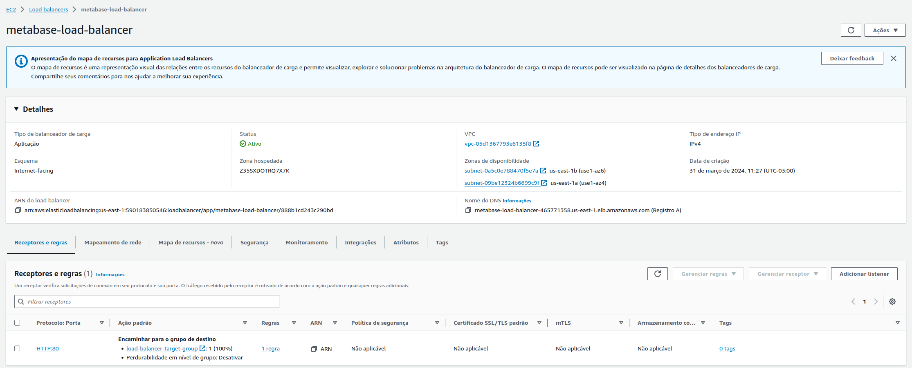

# Auto Scalling da Arquitetura

O auto scalling é uma técnica utilizada para ajustar automaticamente a capacidade de processamento de uma aplicação de acordo com a demanda. No contexto da arquitetura do projeto, o auto scalling é utilizado para ajustar a quantidade de instâncias do Confluent de acordo com a quantidade de mensagens recebidas no tópico do IoT Core e também no provisionamento de instâncias do Metabase.

## Auto Scalling do Confluent Cloud

O Confluent Cloud oferece a capacidade de escalar clusters de Kafka de forma rápida e eficiente, garantindo que os dados sejam processados de forma eficiente e confiável, mesmo em situações de pico de tráfego. O auto scalling do Confluent Cloud é baseado em políticas de auto scalling que definem as regras para aumentar ou diminuir a capacidade de processamento de dados de acordo com as necessidades da aplicação.

As políticas de auto scalling do Confluent Cloud são baseadas em métricas de monitoramento, como o número de mensagens processadas por segundo, o tempo de resposta das requisições e o uso de CPU e memória. Com base nessas métricas, o Confluent Cloud pode ajustar automaticamente a quantidade de instâncias do Kafka para garantir que os dados sejam processados de forma eficiente e confiável.

Dessa forma, o auto scalling do Confluent Cloud permite que a arquitetura do projeto seja altamente escalável e eficiente, garantindo que os dados sejam processados de forma eficiente e confiável, mesmo em situações de pico de tráfego.

### Exemplo de Auto Scalling do Confluent Cloud

#### Tópicos

Durante teste de carga, o número de mensagens recebidas do tópico do IoT Core aumentou significativamente, o que pode sobrecarregar a fila do tópico. Para evitar esse problema, o próprio Confluente Cloud criou novos tópicos e uma nova partição para distribuir a carga de trabalho entre os consumidores.
- **Registro de Tópicos:**


- **Painel de Geral:**


#### Auto Scalling do Metabase

O Metabase é uma ferramenta de visualização de dados que permite criar dashboards e relatórios a partir de dados armazenados em bancos de dados. O auto scalling do Metabase é utilizado para ajustar a quantidade de instâncias do Metabase de acordo com a demanda de usuários e a quantidade de consultas executadas.

### Load Balancer

O Load Balancer é um componente da arquitetura que distribui o tráfego de rede entre várias instâncias de um serviço, garantindo que o tráfego seja distribuído de forma eficiente e confiável. O Load Balancer é utilizado para garantir a disponibilidade e a escalabilidade da aplicação, distribuindo o tráfego de rede entre várias instâncias do Confluent e do Metabase.



### Auto Scalling Group

O Auto Scalling Group é um componente da arquitetura que gerencia a quantidade de instâncias de um serviço de acordo com a demanda. Dessa forma, quando o tráfego de rede aumenta, o Auto Scalling Group cria novas instâncias do serviço para garantir que o tráfego seja distribuído de forma eficiente e confiável. Quando o tráfego de rede diminui, o Auto Scalling Group remove as instâncias do serviço para reduzir os custos de operação. No escopo do projeto, o Auto Scalling Group é utilizado para gerenciar a quantidade de instâncias do Metabase de acordo com a demanda de mensagens e consultas. No exemplo abaixo, é possível visualizar o Auto Scalling Group do Metabase e seu histórico de escalabilidade.


### Launch Configuration

O Launch File é um arquivo de configuração que define as configurações iniciais de uma instância do Metabase, como o tipo de instância, o sistema operacional, o tamanho do disco e as configurações de rede. O Launch File é utilizado para criar novas instâncias do Confluent ou do Metabase de forma automática, garantindo que as instâncias sejam configuradas de acordo com as necessidades da aplicação.

Para isso, no próprio arquivos de configuração do Terraform, foi definido o Launch Configuration para o Metabase, conforme exemplo abaixo:

```hcl

resource "aws_launch_template" "sh_ec2_launch_templ" {
  name_prefix   = "metabase-ec2-launch-template"
  image_id      = "ami-080e1f13689e07408"
  instance_type = "t3.medium"
  key_name      = "metabase_ec2_key"

  lifecycle {
    create_before_destroy = true
  }

  user_data = base64encode(<<-EOF
#!/bin/bash
sudo apt-get update -y
sudo apt-get install ca-certificates curl
sudo install -m 0755 -d /etc/apt/keyrings
sudo curl -fsSL https://download.docker.com/linux/ubuntu/gpg -o /etc/apt/keyrings/docker.asc
sudo chmod a+r /etc/apt/keyrings/docker.asc
echo \
  "deb [arch=$(dpkg --print-architecture) signed-by=/etc/apt/keyrings/docker.asc] https://download.docker.com/linux/ubuntu \
  $(. /etc/os-release && echo "$VERSION_CODENAME") stable" | \
  sudo tee /etc/apt/sources.list.d/docker.list > /dev/null
sudo apt-get update -y
sudo apt-get install docker-ce docker-ce-cli containerd.io docker-buildx-plugin docker-compose-plugin -y

sudo touch /var/docker-compose.yml

sudo echo "version: '3.7'
services:
  metabase:
    image: metabase/metabase:latest
    environment:
      MB_DB_TYPE: postgres
      MB_DB_DBNAME: postgres
      MB_DB_PORT: '5432'
      MB_DB_USER: postgres
      MB_DB_PASS: postgres123
      MB_DB_HOST: 
    ports:
      - '80:3000'" > /var/docker-compose.yml
(sudo systemctl enable docker)
(cd /var && sudo docker compose up -d)
EOF
  )

  network_interfaces {
    associate_public_ip_address = true
    subnet_id                   = aws_subnet.public_subnet_az1.id
    security_groups             = [aws_security_group.private_sg.id]
  }

  tag_specifications {
    resource_type = "instance"
    tags = {
      Name = "metabase-ec2-instance"
    }
  }
}
```

Dessa forma, o Launch Configuration é utilizado para criar novas instâncias do Metabase de forma automática, garantindo que as instâncias sejam configuradas de acordo com as necessidades da aplicação.

## Conclusão

O auto scalling da arquitetura do projeto é uma técnica utilizada para ajustar automaticamente a capacidade de processamento de dados de acordo com a demanda. O auto scalling do Metabase é utilizado para ajustar a quantidade de instâncias do Metabase de acordo com a quantidade de acessos, já o Confluent Cloud consegue fazer o autoscalling de acordo mensagens recebidas no tópico do IoT Core de forma quase que nativa. Dessa forma, o auto scalling da arquitetura do projeto garante que os dados sejam processados e acessados de forma eficiente e confiável, mesmo em situações de pico de tráfego.
