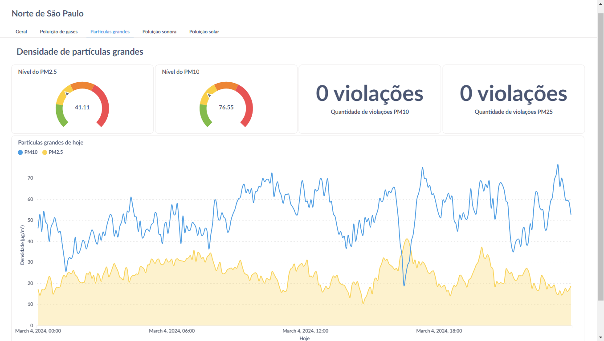

# Metabase

O Metabase é uma ferramenta de software de código aberto projetada para simplificar a análise e a visualização de dados. Ele oferece uma interface intuitiva que permite aos usuários criar consultas, gráficos e painéis interativos sem a necessidade de conhecimento avançado em SQL ou programação. O Metabase suporta a conexão com uma variedade de bancos de dados, como MySQL, PostgreSQL e MongoDB, entre outros.

Além da sua gratuitdade, também podemos utilizar do grande potencial na criação de dashboards públicos, por isso escolhemos ele como nossa ferramenta de dashboards.

## Conexão com o banco de dados

Utilizamos o MongoDB como banco de dados. Por conta da sua natureza ``noSQL``, temos algumas limitações em relação à criação dos gráficos. Contudo, o Metabase possui completa integração com esse tipo de banco de dados, permitindo a simples conexão com as tabelas que precisamos para a criação do dashboard.

## O Dashboard

Dividimos nosso dashboard em 5 partes:

- Visão geral;
- Poluição de gases;
- Partículas grandes;
- Poluição sonora;
- Poluição solar.

### Visão geral

A primeira visualização que há no dashboard (o qual pode ser visualizado em [Dashboard](http://metabase-load-balancer-465771358.us-east-1.elb.amazonaws.com/public/dashboard/6c5c5c87-f215-42ea-ba72-6829a20302da)) é a visão geral da região. Aqui, nosso objetivo é dar apenas uma noção sobre a situação em São Paulo.

Nesse seção, temos 4 seções menores com gráficos relacioandos, respectivamente, aos sensores de densidade de partículas grandes, poluição sonora, poluição de gases e radiação solar:

#### Densidade de partículas grandes

Os 2 primeiros alarmes são sobre os níveis de densidade de gases (medida em micro gramas por metro cúbico \[μg/m³]), simbolizando se a densidade de um tipo de partícula (entre PM2.5 e PM10) em determinada região de São Paulo está Boa, Moderada, Ruim ou Muito Ruim.

#### Poluição sonora

O primeiro alarme é sobre o nível de poluição sonora (medida em decibéis), simbolizando se o barulho em determinada região de São Paulo está Aceitável, Tolerável ou Perigoso, tendo os limites estabelecidos por pesquisas que medem até quantos decibéis começam a danificar o sistema humano. [Fonte](https://www.audiumbrasil.com.br/blog/protecao-auditiva/volume-e-decibeis/#:~:text=O%20volume%20mais%20suave%20percebido,mais%20alto%20que%2050%20dB.).

A segunda informação nessa seção é sobre o número de violações que houve no dia em questão, representando um número onde os sensores mediram valores de ruído maiores que 55 dB (decibéis).

#### Poluição de gases

Os próximos 3 alarmes são sobre os níveis de poluição de gases (medida em partes por milhão ou bilhão), simbolizando se um gás (entre CO, CO2 e NO2) em determinada região de São Paulo está Aceitável, Tolerável ou Perigoso.
Além disso, há um gráfico de linhas com a variação dos 3 gases em suas medidas.

#### Radiação Solar

Para a seção de radiação solar, há um gráfico de linhas com a variação do índice no ano em questão.

### Poluição de gases

A segunda visualização que há no dashboard (o qual pode ser visualizado em [Dashboard](http://metabase-load-balancer-465771358.us-east-1.elb.amazonaws.com/public/dashboard/6c5c5c87-f215-42ea-ba72-6829a20302da)) é a visão geral sobre poluição de gases da região. Aqui, nosso objetivo é demonstrar a poluição de gases na região por uma segunda visualização.

### Partículas grandes

A terceira visualização que há no dashboard é a visão geral sobre a densidade de partículas grandes da região. Aqui, nosso objetivo é demonstrar a poluição do ar na região pelas partículas grandes com uma segunda visualização.

### Poluição sonora

A quarta visualização que há no dashboard (o qual pode ser visualizado em [Dashboard](http://metabase-load-balancer-465771358.us-east-1.elb.amazonaws.com/public/dashboard/6c5c5c87-f215-42ea-ba72-6829a20302da)) é a visão geral sobre poluição sonora da região. Aqui, nosso objetivo é demonstrar a poluição sonora na região por uma segunda visualização.

### Poluição solar

A quinta visualização que há no dashboard (o qual pode ser visualizado em [Dashboard](http://metabase-load-balancer-465771358.us-east-1.elb.amazonaws.com/public/dashboard/6c5c5c87-f215-42ea-ba72-6829a20302da)) é a visão geral sobre poluição solar da região. Aqui, nosso objetivo é demonstrar a poluição solar na região por uma segunda visualização.

