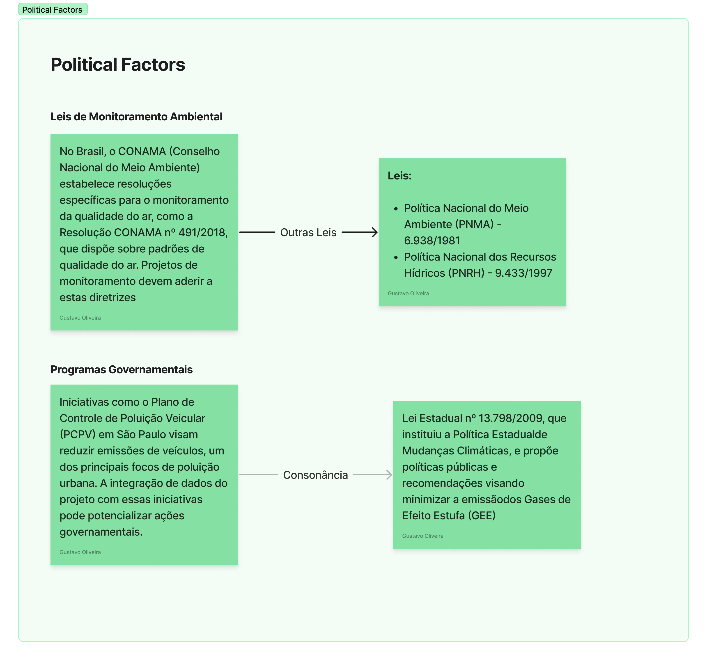
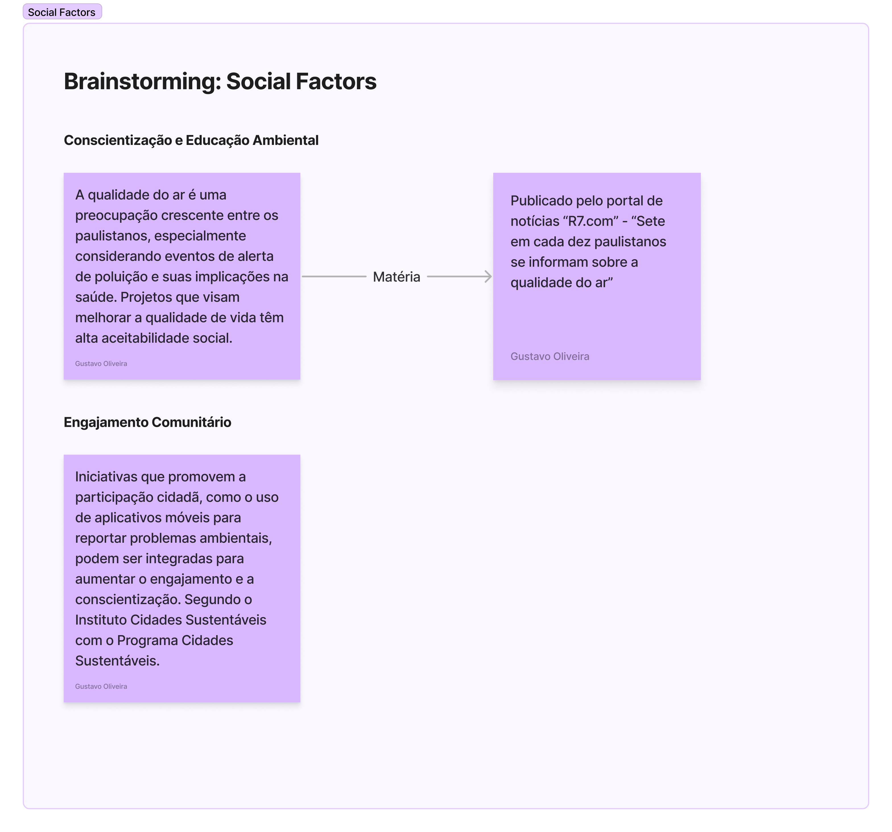
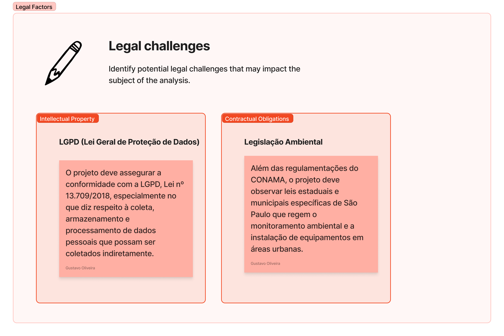
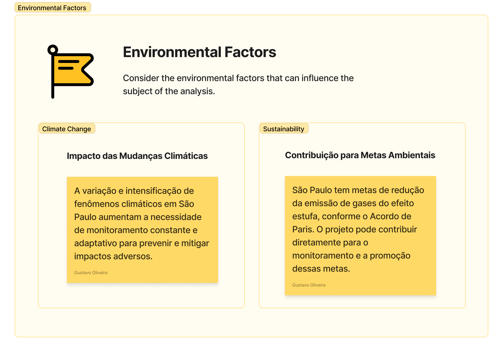

# Análise PESTEL

A análise PESTEL é uma ferramenta estratégica utilizada por organizações para compreender e avaliar o ambiente externo em que operam. Ela envolve a identificação e análise de seis categorias principais de influências macroambientais, fornecendo uma visão abrangente das oportunidades e ameaças que podem impactar a empresa. Aqui está uma descrição detalhada de cada componente:

## Fatores Politicos

Esta categoria abrange fatores relacionados ao ambiente político em que a organização opera. Isso inclui questões como estabilidade política, mudanças de governo, regulamentações governamentais, políticas fiscais e legislação trabalhista. A análise política ajuda a empresa a entender como as decisões políticas podem afetar suas operações, seus mercados-alvo e suas estratégias de negócios.

## Fatores Econômicos

Fatores econômicos referem-se às condições econômicas globais, regionais ou nacionais que afetam a organização. Isso inclui taxas de crescimento econômico, taxas de juros, inflação, desemprego, distribuição de renda e flutuações cambiais. A análise econômica permite que a empresa compreenda o poder de compra dos consumidores, os custos de produção, a demanda do mercado e a viabilidade financeira de seus projetos e investimentos.

## Fatores Sociais

Esta categoria diz respeito aos aspectos socioculturais que moldam o ambiente operacional da empresa. Isso inclui demografia, tendências de estilo de vida, valores culturais, atitudes do consumidor e padrões de comportamento. Ao analisar fatores sociais, a empresa pode identificar preferências do consumidor, necessidades não atendidas e mudanças nas demandas do mercado.

     

## Fatores Tecnológicos

Fatores tecnológicos referem-se ao estado da tecnologia e à sua influência sobre as operações da empresa. Isso inclui avanços tecnológicos, inovações disruptivas, taxas de adoção de novas tecnologias e investimentos em pesquisa e desenvolvimento. A análise tecnológica ajuda a empresa a identificar oportunidades para melhorar a eficiência operacional, desenvolver produtos inovadores e manter-se atualizada em um ambiente de negócios em constante 

## Fatores Ambientais
Esta categoria aborda fatores relacionados ao meio ambiente e à sustentabilidade. Isso inclui mudanças climáticas, regulamentações ambientais, preocupações com a pegada de carbono, gestão de resíduos e responsabilidade social corporativa. A análise ambiental ajuda a empresa a identificar riscos e oportunidades relacionados à sustentabilidade, bem como a desenvolver práticas de negócios responsáveis.

## Fatores Legais

Fatores legais referem-se às leis e regulamentações que impactam as operações da empresa. Isso inclui leis de concorrência, leis de proteção ao consumidor, regulamentações trabalhistas, leis de propriedade intelectual e regulamentações de comércio internacional. A análise legal ajuda a empresa a garantir conformidade com os requisitos legais, bem como a antecipar e responder a mudanças na legislação que possam afetar suas operações.

## Conclusão

Em conjunto, a análise PESTEL oferece uma visão holística do ambiente externo da empresa, permitindo que ela identifique tendências, antecipe mudanças e desenvolva estratégias adaptativas para se manter competitiva e bem-sucedida em seu setor.

Isso nos proporciona uma visão abrangente de como o projeto a ser desenvolvido para a "Prodan" afeta os diversos aspectos que compõem a sociedade ao nosso redor, especialmente por influenciar diretamente a cidade onde residimos.

## Referências

Referências utilizadas para a construção da análise:

1. Poluição no ar mata 11 mil por ano em São Paulo. Disponível em: [pbmc.coppe.ufrj.br/index.php/pt/noticias/832-poluicao-no-ar-mata-11-mil-por-ano-em-sao-paulo](http://pbmc.coppe.ufrj.br/index.php/pt/noticias/832-poluicao-no-ar-mata-11-mil-por-ano-em-sao-paulo)

2. Mercado de sensores. Disponível em: [proximonivel.embratel.com.br/mercado-de-sensores/](https://proximonivel.embratel.com.br/mercado-de-sensores/)

3. Brasil tem condições de monitorar e combater desmatamento, afirmam especialistas. Disponível em: [www12.senado.leg.br/noticias/materias/2020/12/17/brasil-tem-condicoes-de-monitorar-e-combater-desmatamento-afirmam-especialistas](https://www12.senado.leg.br/noticias/materias/2020/12/17/brasil-tem-condicoes-de-monitorar-e-combater-desmatamento-afirmam-especialistas)

4. Conselho Nacional do Meio Ambiente. Disponível em: [conama.mma.gov.br/component/content/article?id=91](https://conama.mma.gov.br/component/content/article?id=91)

5. Plano de Controle de Poluição Veicular do Estado de São Paulo 2020-2022. Disponível em: [cetesb.sp.gov.br/veicular/wp-content/uploads/sites/6/2021/01/PCPV-Plano-de-Controle-de-Poluicao-Veicular-do-Estado-de-Sao-Paulo-2020-2022.pdf](https://cetesb.sp.gov.br/veicular/wp-content/uploads/sites/6/2021/01/PCPV-Plano-de-Controle-de-Poluicao-Veicular-do-Estado-de-Sao-Paulo-2020-2022.pdf)

6. Financiamento à inovação. Disponível em: [finep.gov.br/finep-inovacao-finep-inovacao-e-pesquisa](http://www.finep.gov.br/finep-inovacao-finep-inovacao-e-pesquisa)

7. Boas práticas para cidades sustentáveis. Disponível em: [cidadessustentaveis.org.br/institucional/participacao-cidada_boas-praticas](https://www.cidadessustentaveis.org.br/institucional/participacao-cidada_boas-praticas)

8. Sete em cada dez paulistanos se informam sobre a qualidade do ar. Disponível em: [noticias.r7.com/sao-paulo/sete-em-cada-dez-paulistanos-se-informam-sobre-a-qualidade-do-ar-20092018](https://noticias.r7.com/sao-paulo/sete-em-cada-dez-paulistanos-se-informam-sobre-a-qualidade-do-ar-20092018)

9. Prefeitura de São Paulo - Secretaria Municipal da Saúde. Disponível em: [prefeitura.sp.gov.br/cidade/secretarias/saude/noticias/?p=352547](https://www.prefeitura.sp.gov.br/cidade/secretarias/saude/noticias/?p=352547)

10. Linhas de financiamento BNDES. Disponível em: [bndes.gov.br/SiteBNDES/bndes/bndes_pt/Galerias/Convivencia/Restauracao_Ecologica/linhas_financiamento.html](https://www.bndes.gov.br/SiteBNDES/bndes/bndes_pt/Galerias/Convivencia/Restauracao_Ecologica/linhas_financiamento.html)

11. Programas e Linhas de Financiamento - FINEP. Disponível em: [finep.gov.br/afinep/28-apoio-e-financiamento/programas-e-linhas](http://finep.gov.br/afinep/28-apoio-e-financiamento/programas-e-linhas#:~:text=O%20Finep%20Mais%20Inova%C3%A7%C3%A3o%20%C3%A9,o%20Desenvolvimento%20Tecnol%C3%B3gico%20das%20Telecomunica%C3%A7%C3%B5es)

12. Lei nº 13.709, de 14 de agosto de 2018. Disponível em: [planalto.gov.br/ccivil_03/_ato2015-2018/2018/lei/l13709.htm](https://www.planalto.gov.br/ccivil_03/_ato2015-2018/2018/lei/l13709.htm)