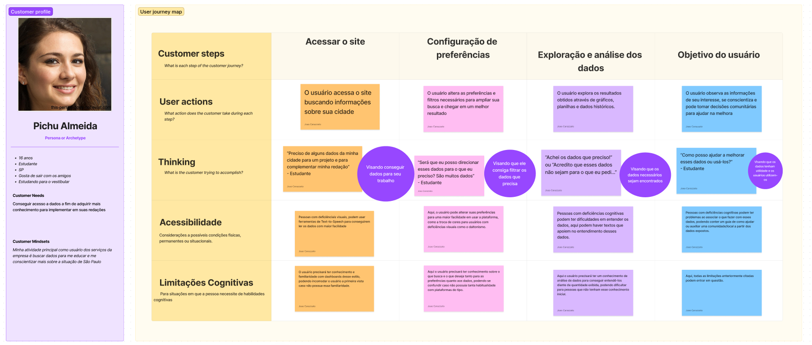
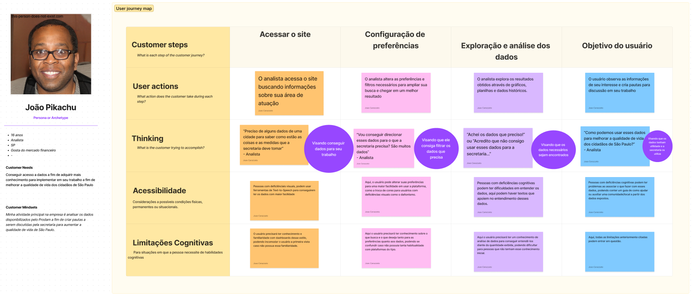
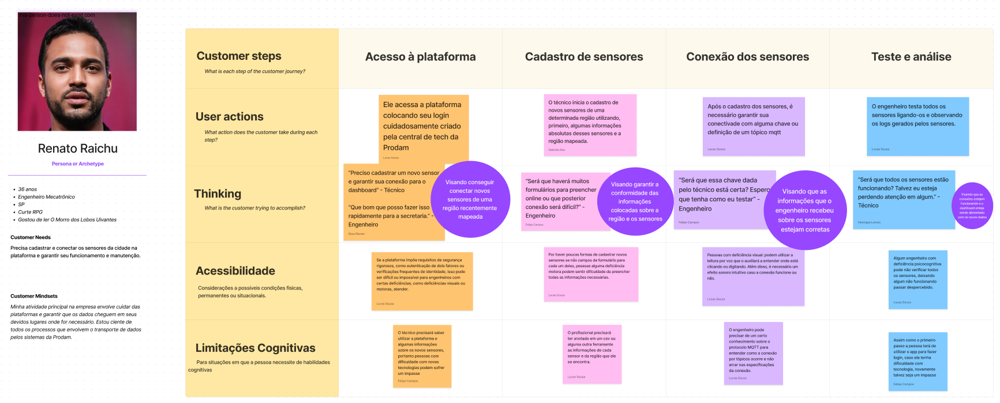

# Jornada do usuário

A jornada do usuário é uma representação do caminho que um usuário percorre ao interagir com um produto, serviço ou marca, desde a descoberta até a realização de uma ação desejada. Mapeada para compreender as diferentes etapas, emoções e experiências do usuário, seu objetivo é identificar oportunidades de melhoria e otimização da experiência, visando aumentar a satisfação, retenção e fidelização. Essa análise é fundamental para o design centrado no usuário e para estratégias de marketing orientadas ao cliente.

## Visão Geral

Foram criadas três jornadas para três personas diferentes que utilizariam o sistema, sendo elas o foco do usuário final: cliente (cidadão), analista e administrador. Todas podem ser encontradas com mais detalhes [aqui](https://www.figma.com/file/PBGed9bHIQowFFTxbhUsfz/Jornada-do-Usu%C3%A1rio?type=whiteboard&node-id=0%3A1&t=pOysCekRsa8fnJDh-1).

### Jornada cidadão

A jornada do cidadão trata-se de um estudante que busca informações para se inteirar mais sobre sua cidade e suas necessidades, sendo categorizado como usuário final secundário, que, apesar de utilizar a plataforma, não a acessará com frequência.

A jornada parte do seguinte fluxograma:

1. O usuário acessa o site buscando informações sobre sua cidade;
2. O usuário altera as preferências e filtros necessários para ampliar sua busca e chegar em um melhor resultado;
3. O usuário explora os resultados obtidos através de gráficos, planilhas e dados históricos;
4. O usuário observa as informações de seu interesse e toma ações diante do que foi exposto.

Aqui, buscamos entender como o usuário como cidadão, irá interagir com a plataforma para seu benefício.

### Jornada analista

A jornada do analista trata-se de um profissional que atua em uma das secretarias do estado de São Paulo, as quais são o principal foco do projeto. Este profissional é um dos usuários que têm maior contato com a plataforma no seu dia a dia.

A jornada parte do seguinte fluxograma:

1. O usuário acessa o site buscando informações sobre sua área de atuação;
2. O usuário altera as preferências e filtros necessários para ampliar sua busca e chegar em um melhor resultado;
3. O usuário explora os resultados obtidos através de gráficos, planilhas e dados históricos;
4. O usuário observa informações de seu interesse e cria pautas para discussão em seu trabalho.

Apesar de ser muito próxima a jornada do cidadão, seus objetivos finais são diferentes e possuem impactos em diferentes áreas.

### Jornada administrador

A jornada do administrador trata-se do usuário técnico da plataforma, sendo responsável por cadastrar novos sensores e realizar sua manutenção adequada.

A jornada parte do seguinte fluxograma:

1. Ele acessa a plataforma colocando seu login cuidadosamente criado pela central tech da Prodam;
2. O técnico inicia o cadastro de novos sensores de uma determinada região utilizando, primeiro, algumas informações absolutas desses sensores e a região mapeada;
3. Após o cadastro dos sensores, é necessário garantir sua conectividade com alguma chave ou definição de um tópico MQTT;
4. O engenheiro testa todos os sensores ligando-os e observando os logs gerados pelos sensores.

Aqui, buscamos entender quais são as dores eminentes do administrador e suas possíveis dificuldades na hora de atuar na plataforma para cadastro de novos sensores, a fim de mitigar esses acontecimentos.